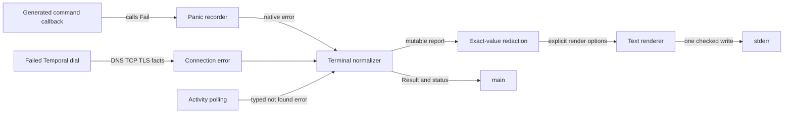

# Structured Error Handling

PR [#1114](https://github.com/temporalio/cli/pull/1114) proves a useful error-handling direction, but transition work remains before it can become the repository standard.

This guide defines the pattern that command families may adopt and the work needed to complete that transition.

- **Last updated:** 2026-07-22
- **Status:** transition architecture
- **Verdict:** PR [#1114](https://github.com/temporalio/cli/pull/1114) is a reference slice, not a finished general framework

## What to adopt now

Command and domain code should keep returning ordinary wrapped Go errors. The terminal boundary should convert those errors into safe display facts. It should also own one stderr render and the final status.

Connection failures and Standalone Activity `NotFound` prove parts of this direction. However, the current branch still contains transition mechanisms that new code must not copy.

- Adopt native wrapped errors, semantic domain facts, explicit terminal adapters, typed token actions, bounded diagnosis, and conservative fallback now.
- Do not copy the panic-based `Fail` recorder, duplicate config resolution, global color mutation, shallow redaction, family-owned report methods, or generic helper coupling.
- Do not add a provider interface yet. Keep explicit terminal adapters until three genuinely different families show a useful shared boundary.
- Do not roll the pattern across more command families until phases A through C in [Transition gates](#transition-gates) pass.

Key files:

- [`internal/temporalcli/terminal.go`](../internal/temporalcli/terminal.go) contains the transition report, renderer, recorder, and `Result`.
- [`internal/temporalcli/commands.go`](../internal/temporalcli/commands.go) owns command execution and final terminal handling.
- [`internal/temporalcli/connecterror.go`](../internal/temporalcli/connecterror.go) carries connection facts and actions in the reference slice.
- [`internal/temporalcli/connectdiag.go`](../internal/temporalcli/connectdiag.go) performs connection-specific diagnosis.
- [`internal/temporalcli/client.go`](../internal/temporalcli/client.go) resolves connection options and starts diagnosis after a failed dial.

## Current flow is useful but transitional



The terminal boundary already returns a [`Result`](../internal/temporalcli/terminal.go). It separates `CommandErr` from `PresentationErr`. Started extensions keep their own output and child status.

The renderer accepts explicit color and shell settings. However, command execution still mutates the package-level `color.NoColor` value. Concurrent `Execute` calls are therefore unsupported.

Connection diagnosis is family-specific and runs only after a failure. It starts after the real dial fails and uses the command context. A three-second cap bounds its work. Set `TEMPORAL_CLI_DISABLE_CONNECT_DIAGNOSIS` to disable it.

## How terminal failures flow

### Reporting a built-in command failure

**Trigger:** A built-in command reaches its final error.

1. **Preserve the cause**: Command code returns the error or adds lowercase operation context with `%w`.
2. **Carry semantic facts**: A domain error stores stable facts that callers may inspect. It does not store color, indentation, or command text.
3. **Adapt at the terminal**: An explicit family adapter converts supported facts into controlled display fields.
4. **Render once**: The current terminal boundary exact-redacts registered secret values and renders one byte slice. It then attempts one checked stderr write. Phase D adds deep-copy and control sanitization for every display field.
5. **Return ownership**: `Result.CommandErr` keeps the error chain, `Result.PresentationErr` keeps a write failure, and `ExitStatus` carries the status.

**When no adapter matches:** Preserve concise legacy text and omit context, checks, and actions that have not passed a family security review.

### Diagnosing a failed connection

**Trigger:** The real Temporal client dial fails while the command context is still active.

1. **Check eligibility**: Skip diagnosis after cancellation or when the kill switch is set.
2. **Apply a family budget**: Bound the connection probe by the command deadline and a three-second maximum.
3. **Collect observations**: Run DNS, TCP, and TLS checks against the configured target.
4. **Avoid privileged retries**: Do not send an API key, OAuth credential, or Temporal RPC. A TLS handshake may present configured client certificates.
5. **Return facts**: Preserve the original dial error and attach only supported observations.

**When diagnosis is unavailable:** Current behavior preserves the original error. The current model has no `unknown` or `skipped` observation state. Deadline classification also remains a known accuracy gap. Phase E adds those states and the related accuracy tests.

A later probe must never be presented as proof of the original failure.

### Passing through a started extension failure

**Trigger:** A `temporal-*` extension starts and exits nonzero.

1. **Keep child streams**: The extension owns its stdout and stderr.
2. **Return the child status**: The parent returns `ExtensionNonZeroExit` with the child exit code.
3. **Skip parent rendering**: The parent does not add another error report.

**When the child never starts:** The parent owns the failure and uses the normal terminal path.

## Ownership boundary for new code

### Copy and adopt now

- Return native Go errors through the call graph.
- Add context with `%w` so `errors.Is` and `errors.As` keep working.
- Put stable semantic facts and the wrapped cause in a small domain error when callers need typed behavior.
- Add an explicit terminal-owned adapter for each admitted family.
- Render actions from typed command and argument tokens. Use long flags in displayed commands.
- Keep diagnosis beside the failing operation, with a family budget, cancellation, documented effects, and a rollback control.
- Preserve a conservative unknown fallback.
- Write parent-owned terminal output once to stderr and return status explicitly.

### Do not copy from the transition slice

- Do not add handwritten or direct callers to the panic-based `CommandOptions.Fail` recorder. Do not add a new generator pattern that emits them. Existing generated commands temporarily inherit this adapter. Phase A changes the generator and removes generated `Fail` calls entirely.
- Do not resolve configuration or collect secrets a second time for display. Build one canonical resolved snapshot during normal option resolution.
- Do not read or mutate `color.NoColor` in new terminal code. Color must be command-local before concurrent execution is supported.
- Do not mutate a shared report while redacting it. Deep-copy controlled display data before sanitization.
- Do not add speculative fields. Remove fields that have no rendered or tested use.
- Do not make domain errors render their own reports. Keep family adapters at the terminal boundary.
- Do not couple families through generic report helpers or add a generic diagnosis framework.

## How to add an error family

A family is eligible only when it has a recurring user problem and stable typed evidence.

1. **Name the owner and scope**: Identify the command family, the failure source, and any partial stdout behavior.
2. **Preserve the native chain**: Add operation context with `%w`; use a small domain error only for stable semantic facts.
3. **Define the fallback**: State the concise message and behavior when classification does not match.
4. **Add one terminal adapter**: Match typed errors or exported status codes before text. Copy only audited facts.
5. **Add an action only when safe**: Use typed tokens, long flags, canonical provenance, and no raw argv.
6. **Bound effects**: If the family diagnoses, specify its deadline, cancellation, external traffic, credentials, and kill switch or rollback.
7. **Prove compatibility**: Test `errors.Is` or `errors.As`, stderr and stdout, status, redaction, control characters, cancellation, and fallback.
8. **Pass the current phase gates**: Broader rollout is blocked until phases A through C pass. Project-standard status is blocked until phases D and E pass.

## Safe Go examples

Error text starts with lowercase and has no trailing punctuation. Wrap the cause with `%w`.

```go
return fmt.Errorf("describe namespace %q: %w", namespace, err)
```

A domain error carries facts and a cause, not display layout.

```go
type namespaceNotFoundError struct {
    namespace string
    cause     error
}

func (e *namespaceNotFoundError) Error() string {
    return fmt.Sprintf("namespace not found: %s", e.namespace)
}

func (e *namespaceNotFoundError) Unwrap() error {
    return e.cause
}
```

The terminal adapter owns the user-facing summary. Keep it lowercase and free of punctuation.

```go
func adaptNamespaceNotFound(err *namespaceNotFoundError) errorReport {
    return errorReport{Summary: "namespace not found"}
}
```

Suggested commands use typed tokens and long flags.

```go
displayInvocation{
    Command: []string{"temporal", "namespace", "describe"},
    Args:    []string{"--namespace", namespace},
}
```

## Security rules for displayed data

Structured display data is a security boundary, not a copy of the error object.

- Admit only fields that the family has classified and reviewed.
- Never replay raw argv. It may contain API keys, codec credentials, headers, or shell control characters.
- Build provenance from the canonical effective configuration. Record presence booleans separately for API key and OAuth.
- Never place API keys, authorization metadata, OAuth tokens, client secrets, certificate or key bytes, arbitrary URLs, or environment snapshots in a report or action.
- Reject NUL, newline, and every other control character before rendering any display field or invocation token.
- Quote each invocation token for the selected display shell. Producers supply unquoted tokens.
- Treat exact known-secret replacement as a final check, not a general scrubber. It cannot remove an unknown secret from legacy prose.
- Deep-copy the report before sanitization so rendering cannot alter domain state or another consumer's value.

The current implementation rejects control characters in invocation tokens. It does not yet enforce the same rule across every summary, context value, check, action label, and usage field. That gap blocks project-standard status.

## Diagnostics remain family-specific

Diagnosis belongs beside the operation it examines. The terminal renderer must not run network, filesystem, or environment checks.

For connection failures:

- Start only after the real dial fails and while the command context remains active.
- Derive the diagnosis context from the command context, not the expired dial context.
- Use the earlier command deadline or a three-second family cap.
- Stop immediately on cancellation.
- Limit probes to documented DNS, TCP, and TLS activity against the configured target.
- Permit configured client certificates during TLS. Never send API-key or OAuth credentials or perform a Temporal RPC.
- Keep `TEMPORAL_CLI_DISABLE_CONNECT_DIAGNOSIS` as the rollback control.
- Describe probe effects because they may add DNS traffic, connections, TLS handshakes, and server log entries during an outage.

The current model records only successful and failed stages. Phase E targets `unknown` and `skipped` observations. It also targets accurate typed deadline handling rather than describing current behavior.

Do not create a generic diagnoser interface. Reconsider shared machinery only after three different families need materially different diagnosis behavior.

## Output and exit contract

| Outcome | stdout | stderr | status |
|---|---|---|---:|
| success or explicit help | successful data or help | empty unless a documented warning applies | `0` |
| parent-owned built-in failure | unchanged successful or documented partial data | one human report | `1` |
| started extension nonzero exit | child-owned | child-owned | child status |
| parent failure before extension start | empty unless already documented | one parent report | `1` |
| stderr write failure | unchanged | one attempted write | intended status |

`PresentationErr` records a report write failure without replacing `CommandErr`. The binary currently ignores `PresentationErr` after `Execute` returns. Explicit ownership and observability therefore remain open transition work.

The `-o json` and `-o jsonl` flags govern stdout data. They do not create a machine-readable stderr error contract. Parent-rendered errors remain human text. They must contain no ANSI when JSON output is requested.

Usage belongs only to input failures for which the terminal can identify the affected command. Those failures render one error and one usage block on stderr. Pre-run, runtime, connection, and other operational failures do not add usage.

## Current limitations block broad adoption

- `Execute` is single-flight because command setup mutates `color.NoColor`.
- The panic recorder depends on every generated `Fail` call remaining terminal and synchronous.
- Connection display reconstructs provenance and known secrets instead of consuming one canonical resolved snapshot.
- Redaction mutates shallow report data and exact replacement does not make arbitrary fallback prose safe.
- Control-character rejection is complete for invocation tokens only.
- Authentication, authorization, and deadline diagnosis need stronger typed evidence and separate accuracy tests.
- Automatic connection probes can add pressure and server log noise during an outage.
- `PresentationErr` has no explicit process-level reporting or telemetry owner.
- Some report fields and helper couplings belong to the transition slice rather than the durable pattern.
- Direct `os.Exit` calls in successful-output broken-pipe handling remain outside this terminal-failure boundary.

## Transition gates

| Phase | Owner | Required result | Measurable exit criteria |
|---|---|---|---|
| A: isolate and retire recorder | command runtime and generator owners | Built-in failures return through normal control flow | No handwritten or direct `Fail` callers and no new generator pattern emits them; the changed generator removes generated `Fail` calls entirely; sentinel cleanup tests pass; panic recorder removed |
| B: canonical config and redaction snapshot | client config and security owners | One effective snapshot supplies provenance and known secrets | Flag, environment, profile, disabled-source, API-key, OAuth, header, and TLS precedence tests pass; duplicate resolution removed |
| C: command-local color and concurrency | command runtime owner | `Execute` no longer reads or writes global color state | Parallel conflicting-color `Execute` test passes under `go test -race`; single-flight restriction removed |
| D: terminal ownership and sanitization | terminal and security owners | Terminal adapters own conversion and sanitize deep copies | Family `report()` methods and unused fields removed; all display fields reject controls; mutation-isolation tests pass; `PresentationErr` owner documented |
| E: diagnosis correctness and operations | connection and resilience owners | Connection diagnosis is accurate and operationally bounded | Authn, authz, deadline, cancellation, wall-clock, no-credential, kill-switch, and outage-pressure tests pass; effects documented |
| F: third-family checkpoint | architecture owner and three family owners | Evidence decides whether extraction helps | Three genuinely different families are implemented; coupling is measured; keep explicit adapters unless a package or interface reduces proven duplication |

Broader family rollout is blocked on A through C. Declaring this the project standard is blocked on D and E. A provider interface or package extraction is reconsidered only at F.

## Validation slices and rollout

PR [#1114](https://github.com/temporalio/cli/pull/1114) is the connection transition slice. Copy its staged user experience, bounded family diagnosis, cause preservation, and typed action direction. Do not copy its transition implementation as a general framework.

Standalone Activity `NotFound` is the second validation slice. It proves that a typed server error can retain its `errors.As` chain. The terminal can also add conservative text without a speculative action. Two slices are not enough to justify an interface.

Rollout order:

1. Complete phases A through C before admitting more families.
2. Use connection and Activity tests to protect the two validation slices during the transition.
3. Complete phases D and E before publishing this pattern as the repository standard.
4. Admit one genuinely different third family with its own owner and compatibility matrix.
5. Run phase F and keep explicit adapters unless the three-family evidence supports extraction.

## Where the transition lives

### Core contracts

| Contract | Location | Current role |
|---|---|---|
| `Result` and renderer | [`internal/temporalcli/terminal.go`](../internal/temporalcli/terminal.go) | Separates command, presentation, and status outcomes |
| command runtime | [`internal/temporalcli/commands.go`](../internal/temporalcli/commands.go) | Owns Cobra execution, usage, terminal handling, and transition recorder |
| process exit | [`cmd/temporal/main.go`](../cmd/temporal/main.go) | Converts `Result.ExitStatus` into process status |
| extension boundary | [`internal/temporalcli/commands.extension.go`](../internal/temporalcli/commands.extension.go) | Preserves child streams and child status |
| connection facts and actions | [`internal/temporalcli/connecterror.go`](../internal/temporalcli/connecterror.go) | Reference family adapter, with transition coupling still present |
| connection probes | [`internal/temporalcli/connectdiag.go`](../internal/temporalcli/connectdiag.go) | Three-second DNS, TCP, and TLS diagnosis |
| effective client setup | [`internal/temporalcli/client.go`](../internal/temporalcli/client.go) | Dial boundary and current duplicate display provenance resolution |

### Test anchors

- [`internal/temporalcli/terminal_test.go`](../internal/temporalcli/terminal_test.go) covers one-write behavior, error identity, shell quoting, redaction, color restoration, and recorder assumptions.
- [`internal/temporalcli/connectdiag_test.go`](../internal/temporalcli/connectdiag_test.go) covers transport classification, deadline interruption, actions, and rendered checks.
- [`internal/temporalcli/client_test.go`](../internal/temporalcli/client_test.go) covers dial timeouts, kill-switch behavior, JSON color, profile provenance, and command timeout.
- [`internal/temporalcli/commands.extension_test.go`](../internal/temporalcli/commands.extension_test.go) covers extension streams, status, timeout, and cancellation.
- [`internal/temporalcli/commands.activity_internal_test.go`](../internal/temporalcli/commands.activity_internal_test.go) covers Activity `NotFound` cause preservation.

### Verification commands

```sh
# This root command does not enter the nested cliext module.
go test ./...
# The current branch has a known standalone cliext compile mismatch. Until it is fixed,
# this command must match the recorded baseline exception and must not be called green.
(cd cliext && go test ./...)
# This currently exposes the documented global-color race and is expected to fail
# until Phase C. It becomes a required green gate in Phase C.
go test -race ./internal/temporalcli
make gen
git diff --exit-code
make gen-docs
```

Run focused transition tests while changing the terminal path:

```sh
go test ./internal/temporalcli -run 'Test(HandleTerminalError|RenderErrorText|RecorderSeam|RenderInvocation|FinishCommand|KnownSecrets|CaptureEffective|DiagnoseConnection|ArmReadDeadline|ConnectDiagnosis_|Extension_|ActivityNotFound)' -count=1
```

## Where to learn more

- [`CONTRIBUTING.md`](../CONTRIBUTING.md) describes repository build, test, generation, and command contribution workflows.
- [PR #1114](https://github.com/temporalio/cli/pull/1114) is the reference connection transition slice.
