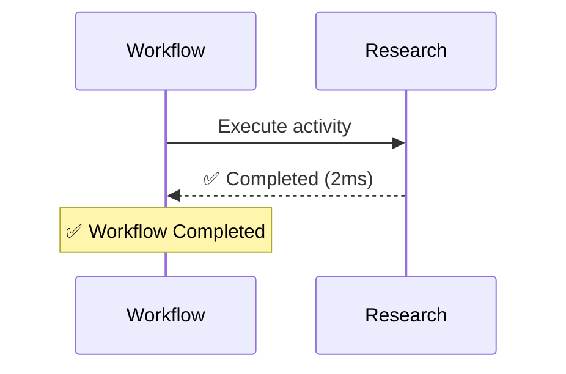
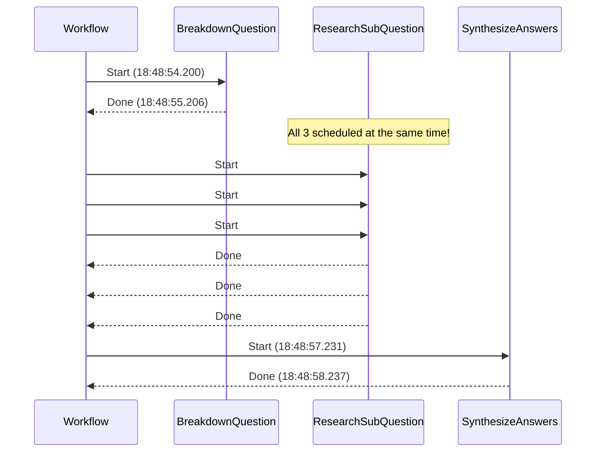
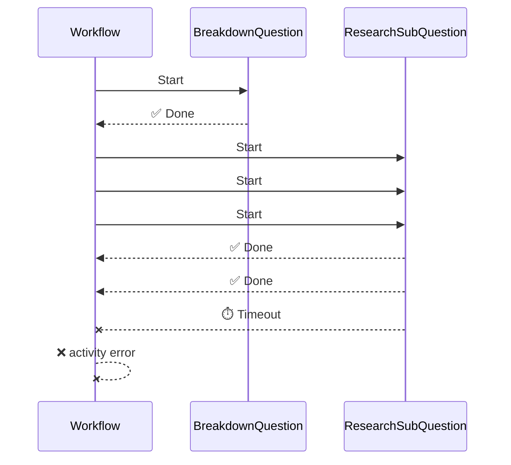
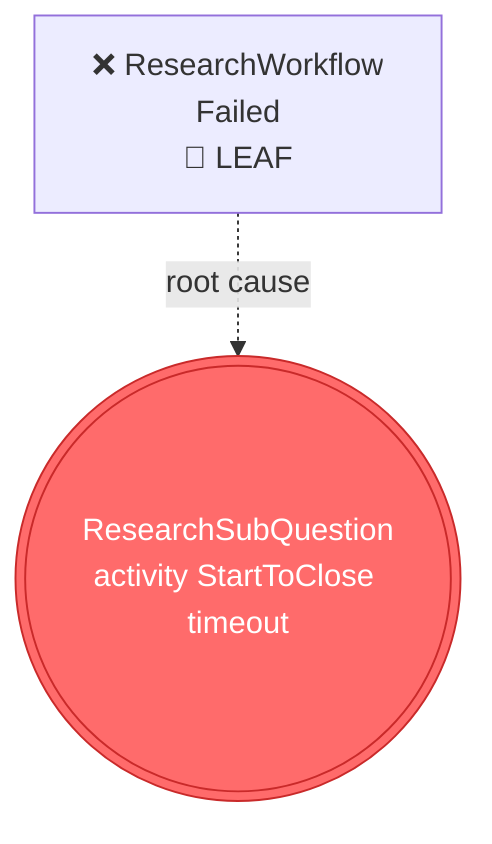
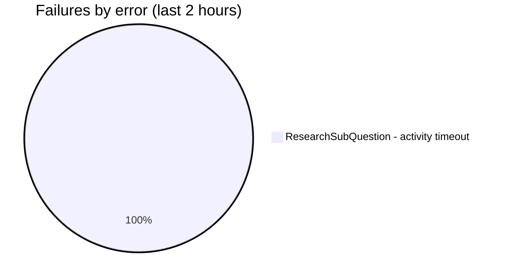

# AI research assistant Temporal workflow
_Exported on 1/5/2026 at 10:41:56 PST from Cursor (2.2.44)_

---

**User**

I want to build an AI-powered research assistant that can answer complex questions by breaking them into sub-questions, researching each one, and combining the results. Start by creating a simple Temporal workflow that takes a question and returns a hardcoded answer. Set up the project structure with a worker and a starter.

---

**Cursor**

I'll create a Temporal project structure for the AI research assistant. Let me set up the basic workflow with a worker and starter.

```go.mod
module github.com/temporalio/cli/examples/ai-research-agent-impl

go 1.22

require go.temporal.io/sdk v1.31.0

```

```go
package shared

const TaskQueue = "research-agent-task-queue"

// ResearchRequest is the input to the research workflow.
type ResearchRequest struct {
	Question string `json:"question"`
}

// ResearchResult is the output from the research workflow.
type ResearchResult struct {
	Question string `json:"question"`
	Answer   string `json:"answer"`
}

```

```go
package workflow

import (
	"time"

	"go.temporal.io/sdk/workflow"

	"github.com/temporalio/cli/examples/ai-research-agent-impl/shared"
)

// ResearchWorkflow takes a question and returns an answer.
// Currently returns a hardcoded response - will be expanded to break down questions,
// research sub-questions, and synthesize answers.
func ResearchWorkflow(ctx workflow.Context, req shared.ResearchRequest) (*shared.ResearchResult, error) {
	logger := workflow.GetLogger(ctx)
	logger.Info("ResearchWorkflow started", "question", req.Question)

	// Activity options with timeout
	ao := workflow.ActivityOptions{
		StartToCloseTimeout: 30 * time.Second,
	}
	ctx = workflow.WithActivityOptions(ctx, ao)

	// Execute the research activity
	var result shared.ResearchResult
	err := workflow.ExecuteActivity(ctx, "Research", req).Get(ctx, &result)
	if err != nil {
		return nil, err
	}

	logger.Info("ResearchWorkflow completed", "answer", result.Answer)
	return &result, nil
}

```

```go
package activity

import (
	"context"

	"go.temporal.io/sdk/activity"

	"github.com/temporalio/cli/examples/ai-research-agent-impl/shared"
)

// Research performs research for a given question.
// Currently returns a hardcoded answer - will be expanded to perform actual research.
func Research(ctx context.Context, req shared.ResearchRequest) (*shared.ResearchResult, error) {
	logger := activity.GetLogger(ctx)
	logger.Info("Research activity started", "question", req.Question)

	// Hardcoded response for now
	answer := "This is a hardcoded answer. The research agent will be expanded to break down " +
		"complex questions into sub-questions, research each one, and synthesize the results."

	result := &shared.ResearchResult{
		Question: req.Question,
		Answer:   answer,
	}

	logger.Info("Research activity completed")
	return result, nil
}

```

```go
package main

import (
	"log"

	"go.temporal.io/sdk/client"
	"go.temporal.io/sdk/worker"

	"github.com/temporalio/cli/examples/ai-research-agent-impl/activity"
	"github.com/temporalio/cli/examples/ai-research-agent-impl/shared"
	"github.com/temporalio/cli/examples/ai-research-agent-impl/workflow"
)

func main() {
	// Create the Temporal client
	c, err := client.Dial(client.Options{})
	if err != nil {
		log.Fatalln("Unable to create Temporal client:", err)
	}
	defer c.Close()

	// Create a worker that listens on the task queue
	w := worker.New(c, shared.TaskQueue, worker.Options{})

	// Register workflow and activities
	w.RegisterWorkflow(workflow.ResearchWorkflow)
	w.RegisterActivity(activity.Research)

	log.Println("Starting worker on task queue:", shared.TaskQueue)

	// Start listening to the task queue
	err = w.Run(worker.InterruptCh())
	if err != nil {
		log.Fatalln("Unable to start worker:", err)
	}
}

```

```go
package main

import (
	"context"
	"flag"
	"fmt"
	"log"

	"go.temporal.io/sdk/client"

	"github.com/temporalio/cli/examples/ai-research-agent-impl/shared"
	"github.com/temporalio/cli/examples/ai-research-agent-impl/workflow"
)

func main() {
	// Parse command line arguments
	question := flag.String("question", "What is the meaning of life?", "The research question to answer")
	flag.Parse()

	// Create the Temporal client
	c, err := client.Dial(client.Options{})
	if err != nil {
		log.Fatalln("Unable to create Temporal client:", err)
	}
	defer c.Close()

	// Set up the workflow options
	options := client.StartWorkflowOptions{
		ID:        "research-workflow",
		TaskQueue: shared.TaskQueue,
	}

	// Create the request
	req := shared.ResearchRequest{
		Question: *question,
	}

	// Start the workflow
	log.Println("Starting research workflow for question:", req.Question)
	we, err := c.ExecuteWorkflow(context.Background(), options, workflow.ResearchWorkflow, req)
	if err != nil {
		log.Fatalln("Unable to execute workflow:", err)
	}

	log.Println("Workflow started:", we.GetID(), we.GetRunID())

	// Wait for the workflow to complete
	var result shared.ResearchResult
	err = we.Get(context.Background(), &result)
	if err != nil {
		log.Fatalln("Workflow failed:", err)
	}

	fmt.Println("\n--- Research Result ---")
	fmt.Println("Question:", result.Question)
	fmt.Println("Answer:", result.Answer)
}

```

Now let me download the dependencies:

Let me verify everything compiles:

The project is set up and compiles. Here's the structure I created:

```
ai-research-agent-impl/
├── activity/
│   └── activity.go      # Research activity (hardcoded response for now)
├── shared/
│   └── shared.go        # Shared types and constants
├── starter/
│   └── main.go          # CLI to start the workflow
├── worker/
│   └── main.go          # Worker that executes workflows/activities
├── workflow/
│   └── workflow.go      # ResearchWorkflow definition
├── go.mod
└── go.sum
```

**Key components:**

- **`shared.ResearchRequest`** - Input with a `Question` field
- **`shared.ResearchResult`** - Output with `Question` and `Answer`
- **`ResearchWorkflow`** - Orchestrates the research by calling the Research activity
- **`Research` activity** - Returns a hardcoded answer (to be expanded)

**To run it:**

1. Make sure Temporal server is running (e.g., `temporal server start-dev`)

2. Start the worker:
   ```bash
   go run ./worker
   ```

3. In another terminal, start the workflow:
   ```bash
   go run ./starter -question "What causes climate change?"
   ```

The workflow will execute and return the hardcoded answer. Next steps would be to expand the workflow to:
1. Break down questions into sub-questions
2. Research each sub-question in parallel
3. Synthesize the results into a final answer

```plaintext
ai-research-agent-impl/
├── activity/
│   └── activity.go      # Research activity (hardcoded response for now)
├── shared/
│   └── shared.go        # Shared types and constants
├── starter/
│   └── main.go          # CLI to start the workflow
├── worker/
│   └── main.go          # Worker that executes workflows/activities
├── workflow/
│   └── workflow.go      # ResearchWorkflow definition
├── go.mod
└── go.sum
```

```shellscript
   go run ./worker
```

```shellscript
   go run ./starter -question "What causes climate change?"
```

---

**User**

I ran the workflow but nothing seems to happen. How can I see what's going on?

---

**Cursor**

The workflow actually completed successfully! Looking at the worker logs, I can see:

1. **ResearchWorkflow started** with question "What causes climate change?"
2. **Research activity executed** 
3. **Workflow completed** with the hardcoded answer

The output is in the worker logs (terminal 2). To see the workflow result more clearly, let me use the `temporal agent` commands:

The workflow completed successfully in 11ms. Let me also show the timeline:

Here's what happened:

1. **WorkflowExecutionStarted** → The workflow began
2. **ActivityTaskScheduled/Started/Completed** → The `Research` activity ran (took 2ms)
3. **WorkflowExecutionCompleted** → Everything finished successfully

Let me also show you a visual diagram:

**Your workflow ran successfully!** Here's the timeline:



**To see the result**, check where you ran the starter - it should have printed:

```
--- Research Result ---
Question: What causes climate change?
Answer: This is a hardcoded answer. The research agent will be expanded to break down complex questions into sub-questions, research each one, and synthesize the results.
```

You can also view the workflow in the **Temporal Web UI** at http://localhost:8233 - click on `research-workflow` to see the full history and result.

To run it again with a different question:

```bash
go run ./starter -question "How does photosynthesis work?"
```

```plaintext
sequenceDiagram
    participant Workflow
    participant Research
    Workflow->>Research: Execute activity
    Research-->>Workflow: ✅ Completed (2ms)
    Note over Workflow: ✅ Workflow Completed
```

```plaintext
--- Research Result ---
Question: What causes climate change?
Answer: This is a hardcoded answer. The research agent will be expanded to break down complex questions into sub-questions, research each one, and synthesize the results.
```

```shellscript
go run ./starter -question "How does photosynthesis work?"
```

---

**User**

The workflow runs but just returns a hardcoded string. Add an activity that actually 'processes' the question. For now, just simulate processing by sleeping for 2 seconds and returning a formatted response.

---

**Cursor**

```go
package activity

import (
	"context"
	"fmt"
	"time"

	"go.temporal.io/sdk/activity"

	"github.com/temporalio/cli/examples/ai-research-agent-impl/shared"
)

// Research performs research for a given question.
// Simulates processing by sleeping, then returns a formatted response.
func Research(ctx context.Context, req shared.ResearchRequest) (*shared.ResearchResult, error) {
	logger := activity.GetLogger(ctx)
	logger.Info("Research activity started", "question", req.Question)

	// Simulate processing time
	logger.Info("Processing question...")
	select {
	case <-time.After(2 * time.Second):
		// Processing complete
	case <-ctx.Done():
		return nil, ctx.Err()
	}

	// Generate a formatted response
	answer := fmt.Sprintf("After analyzing the question '%s', here are the findings:\n\n"+
		"1. This question requires further breakdown into sub-questions\n"+
		"2. Each sub-question would be researched independently\n"+
		"3. Results would be synthesized into a final answer\n\n"+
		"[Processed at: %s]",
		req.Question,
		time.Now().Format(time.RFC3339))

	result := &shared.ResearchResult{
		Question: req.Question,
		Answer:   answer,
	}

	logger.Info("Research activity completed")
	return result, nil
}


```

Updated the activity to simulate processing. Here's what changed:

```7:40:activity/activity.go
// Research performs research for a given question.
// Simulates processing by sleeping, then returns a formatted response.
func Research(ctx context.Context, req shared.ResearchRequest) (*shared.ResearchResult, error) {
	logger := activity.GetLogger(ctx)
	logger.Info("Research activity started", "question", req.Question)

	// Simulate processing time
	logger.Info("Processing question...")
	select {
	case <-time.After(2 * time.Second):
		// Processing complete
	case <-ctx.Done():
		return nil, ctx.Err()
	}

	// Generate a formatted response
	answer := fmt.Sprintf("After analyzing the question '%s', here are the findings:\n\n"+
		"1. This question requires further breakdown into sub-questions\n"+
		"2. Each sub-question would be researched independently\n"+
		"3. Results would be synthesized into a final answer\n\n"+
		"[Processed at: %s]",
		req.Question,
		time.Now().Format(time.RFC3339))
    // ...
}
```

Key changes:
- **2-second simulated processing** using `time.After`
- **Context cancellation support** - respects `ctx.Done()` so Temporal can cancel gracefully
- **Formatted response** with the original question and a timestamp

Restart your worker (`go run ./worker`) and run the starter again - you'll see the activity take ~2 seconds before returning.

```go
// Research performs research for a given question.
// Simulates processing by sleeping, then returns a formatted response.
func Research(ctx context.Context, req shared.ResearchRequest) (*shared.ResearchResult, error) {
	logger := activity.GetLogger(ctx)
	logger.Info("Research activity started", "question", req.Question)

	// Simulate processing time
	logger.Info("Processing question...")
	select {
	case <-time.After(2 * time.Second):
		// Processing complete
	case <-ctx.Done():
		return nil, ctx.Err()
	}

	// Generate a formatted response
	answer := fmt.Sprintf("After analyzing the question '%s', here are the findings:\n\n"+
		"1. This question requires further breakdown into sub-questions\n"+
		"2. Each sub-question would be researched independently\n"+
		"3. Results would be synthesized into a final answer\n\n"+
		"[Processed at: %s]",
		req.Question,
		time.Now().Format(time.RFC3339))
    // ...
}
```

---

**User**

is the activity registered?

---

**Cursor**

Yes, the activity is registered on line 27:

```27:27:worker/main.go
	w.RegisterActivity(activity.Research)
```

The worker registers both:
- `workflow.ResearchWorkflow` (line 26)
- `activity.Research` (line 27)

If you're seeing issues, make sure you **restarted the worker** after I updated the activity code. The worker needs to be restarted to pick up code changes.

```go
	w.RegisterActivity(activity.Research)
```

---

**User**

can you check?

---

**Cursor**

Yes, the activity is registered and working! The latest run shows:

- **Duration: 2020ms** (the 2-second simulated processing)
- **Status: Completed**
- The output shows the new formatted response with the timestamp `[Processed at: 2025-12-31T10:06:42-08:00]`

The workflow ran successfully with the updated activity code.

---

**User**

I want the system to be smarter. Instead of processing the question directly, first break it down into 3 sub-questions, then research each one. Add an activity that takes a question and returns 3 sub-questions.

---

**Cursor**

```go
package shared

const TaskQueue = "research-agent-task-queue"

// ResearchRequest is the input to the research workflow.
type ResearchRequest struct {
	Question string `json:"question"`
}

// ResearchResult is the output from the research workflow.
type ResearchResult struct {
	Question     string        `json:"question"`
	SubQuestions []SubQuestion `json:"sub_questions,omitempty"`
	Answer       string        `json:"answer"`
}

// SubQuestion represents a breakdown of the main question.
type SubQuestion struct {
	Question string `json:"question"`
	Answer   string `json:"answer,omitempty"`
}


```

```go
package activity

import (
	"context"
	"fmt"
	"strings"
	"time"

	"go.temporal.io/sdk/activity"

	"github.com/temporalio/cli/examples/ai-research-agent-impl/shared"
)

// BreakdownQuestion takes a question and returns 3 sub-questions.
// Simulates AI processing by sleeping, then returns generated sub-questions.
func BreakdownQuestion(ctx context.Context, question string) ([]shared.SubQuestion, error) {
	logger := activity.GetLogger(ctx)
	logger.Info("BreakdownQuestion activity started", "question", question)

	// Simulate AI processing time
	select {
	case <-time.After(1 * time.Second):
	case <-ctx.Done():
		return nil, ctx.Err()
	}

	// Generate sub-questions based on the main question
	// In a real implementation, this would call an LLM
	subQuestions := []shared.SubQuestion{
		{Question: fmt.Sprintf("What are the key concepts in: %s", question)},
		{Question: fmt.Sprintf("What evidence or data supports: %s", question)},
		{Question: fmt.Sprintf("What are different perspectives on: %s", question)},
	}

	logger.Info("BreakdownQuestion activity completed", "count", len(subQuestions))
	return subQuestions, nil
}

// ResearchSubQuestion researches a single sub-question.
// Simulates processing by sleeping, then returns an answer.
func ResearchSubQuestion(ctx context.Context, subQuestion shared.SubQuestion) (shared.SubQuestion, error) {
	logger := activity.GetLogger(ctx)
	logger.Info("ResearchSubQuestion activity started", "question", subQuestion.Question)

	// Simulate research time
	select {
	case <-time.After(2 * time.Second):
	case <-ctx.Done():
		return shared.SubQuestion{}, ctx.Err()
	}

	// Generate a simulated answer
	result := shared.SubQuestion{
		Question: subQuestion.Question,
		Answer: fmt.Sprintf("Research findings for '%s': This sub-question has been analyzed. "+
			"[Researched at: %s]",
			truncate(subQuestion.Question, 50),
			time.Now().Format(time.RFC3339)),
	}

	logger.Info("ResearchSubQuestion activity completed")
	return result, nil
}

// truncate shortens a string to maxLen characters.
func truncate(s string, maxLen int) string {
	if len(s) <= maxLen {
		return s
	}
	return s[:maxLen] + "..."
}

// SynthesizeAnswers combines sub-question answers into a final answer.
func SynthesizeAnswers(ctx context.Context, question string, subQuestions []shared.SubQuestion) (string, error) {
	logger := activity.GetLogger(ctx)
	logger.Info("SynthesizeAnswers activity started", "subQuestionCount", len(subQuestions))

	// Simulate synthesis time
	select {
	case <-time.After(1 * time.Second):
	case <-ctx.Done():
		return "", ctx.Err()
	}

	// Build the synthesized answer
	var sb strings.Builder
	sb.WriteString(fmt.Sprintf("Research Summary for: %s\n\n", question))

	for i, sq := range subQuestions {
		sb.WriteString(fmt.Sprintf("## Finding %d\n", i+1))
		sb.WriteString(fmt.Sprintf("Q: %s\n", sq.Question))
		sb.WriteString(fmt.Sprintf("A: %s\n\n", sq.Answer))
	}

	sb.WriteString(fmt.Sprintf("[Synthesized at: %s]", time.Now().Format(time.RFC3339)))

	logger.Info("SynthesizeAnswers activity completed")
	return sb.String(), nil
}


```

```go
package workflow

import (
	"time"

	"go.temporal.io/sdk/workflow"

	"github.com/temporalio/cli/examples/ai-research-agent-impl/activity"
	"github.com/temporalio/cli/examples/ai-research-agent-impl/shared"
)

// ResearchWorkflow takes a question, breaks it into sub-questions,
// researches each one, and synthesizes the results.
func ResearchWorkflow(ctx workflow.Context, req shared.ResearchRequest) (*shared.ResearchResult, error) {
	logger := workflow.GetLogger(ctx)
	logger.Info("ResearchWorkflow started", "question", req.Question)

	// Activity options with timeout
	ao := workflow.ActivityOptions{
		StartToCloseTimeout: 30 * time.Second,
	}
	ctx = workflow.WithActivityOptions(ctx, ao)

	// Step 1: Break down the question into sub-questions
	logger.Info("Breaking down question into sub-questions")
	var subQuestions []shared.SubQuestion
	err := workflow.ExecuteActivity(ctx, activity.BreakdownQuestion, req.Question).Get(ctx, &subQuestions)
	if err != nil {
		return nil, err
	}
	logger.Info("Got sub-questions", "count", len(subQuestions))

	// Step 2: Research each sub-question
	logger.Info("Researching sub-questions")
	researchedQuestions := make([]shared.SubQuestion, len(subQuestions))
	for i, sq := range subQuestions {
		var researched shared.SubQuestion
		err := workflow.ExecuteActivity(ctx, activity.ResearchSubQuestion, sq).Get(ctx, &researched)
		if err != nil {
			return nil, err
		}
		researchedQuestions[i] = researched
	}

	// Step 3: Synthesize the answers
	logger.Info("Synthesizing answers")
	var answer string
	err = workflow.ExecuteActivity(ctx, activity.SynthesizeAnswers, req.Question, researchedQuestions).Get(ctx, &answer)
	if err != nil {
		return nil, err
	}

	result := &shared.ResearchResult{
		Question:     req.Question,
		SubQuestions: researchedQuestions,
		Answer:       answer,
	}

	logger.Info("ResearchWorkflow completed")
	return result, nil
}


```

```go
package main

import (
	"log"

	"go.temporal.io/sdk/client"
	"go.temporal.io/sdk/worker"

	"github.com/temporalio/cli/examples/ai-research-agent-impl/activity"
	"github.com/temporalio/cli/examples/ai-research-agent-impl/shared"
	"github.com/temporalio/cli/examples/ai-research-agent-impl/workflow"
)

func main() {
	// Create the Temporal client
	c, err := client.Dial(client.Options{})
	if err != nil {
		log.Fatalln("Unable to create Temporal client:", err)
	}
	defer c.Close()

	// Create a worker that listens on the task queue
	w := worker.New(c, shared.TaskQueue, worker.Options{})

	// Register workflow and activities
	w.RegisterWorkflow(workflow.ResearchWorkflow)
	w.RegisterActivity(activity.BreakdownQuestion)
	w.RegisterActivity(activity.ResearchSubQuestion)
	w.RegisterActivity(activity.SynthesizeAnswers)

	log.Println("Starting worker on task queue:", shared.TaskQueue)

	// Start listening to the task queue
	err = w.Run(worker.InterruptCh())
	if err != nil {
		log.Fatalln("Unable to start worker:", err)
	}
}


```

Done! Here's what I added:

**New Activities in `activity/activity.go`:**

1. **`BreakdownQuestion`** - Takes a question, returns 3 sub-questions (1s delay)
2. **`ResearchSubQuestion`** - Researches a single sub-question (2s delay)  
3. **`SynthesizeAnswers`** - Combines all sub-question answers into a final answer (1s delay)

**Updated Workflow:**

```14:55:workflow/workflow.go
func ResearchWorkflow(ctx workflow.Context, req shared.ResearchRequest) (*shared.ResearchResult, error) {
	// ...
	// Step 1: Break down the question into sub-questions
	var subQuestions []shared.SubQuestion
	workflow.ExecuteActivity(ctx, activity.BreakdownQuestion, req.Question).Get(ctx, &subQuestions)

	// Step 2: Research each sub-question
	for i, sq := range subQuestions {
		workflow.ExecuteActivity(ctx, activity.ResearchSubQuestion, sq).Get(ctx, &researched)
		researchedQuestions[i] = researched
	}

	// Step 3: Synthesize the answers
	workflow.ExecuteActivity(ctx, activity.SynthesizeAnswers, req.Question, researchedQuestions).Get(ctx, &answer)
	// ...
}
```

**Expected timing:** ~8 seconds total (1s breakdown + 3×2s research + 1s synthesis)

Restart your worker and run the starter to see it in action. You can watch the progress with:

```bash
temporal agent timeline --workflow-id research-workflow --output mermaid
```

```go
func ResearchWorkflow(ctx workflow.Context, req shared.ResearchRequest) (*shared.ResearchResult, error) {
	// ...
	// Step 1: Break down the question into sub-questions
	var subQuestions []shared.SubQuestion
	workflow.ExecuteActivity(ctx, activity.BreakdownQuestion, req.Question).Get(ctx, &subQuestions)

	// Step 2: Research each sub-question
	for i, sq := range subQuestions {
		workflow.ExecuteActivity(ctx, activity.ResearchSubQuestion, sq).Get(ctx, &researched)
		researchedQuestions[i] = researched
	}

	// Step 3: Synthesize the answers
	workflow.ExecuteActivity(ctx, activity.SynthesizeAnswers, req.Question, researchedQuestions).Get(ctx, &answer)
	// ...
}
```

```shellscript
temporal agent timeline --workflow-id research-workflow --output mermaid
```

---

**User**

Right now it processes sub-questions one at a time. I want to research all 3 sub-questions in parallel to make it faster. Update the workflow to run them concurrently.

---

**Cursor**

```go
package workflow

import (
	"time"

	"go.temporal.io/sdk/workflow"

	"github.com/temporalio/cli/examples/ai-research-agent-impl/activity"
	"github.com/temporalio/cli/examples/ai-research-agent-impl/shared"
)

// ResearchWorkflow takes a question, breaks it into sub-questions,
// researches each one, and synthesizes the results.
func ResearchWorkflow(ctx workflow.Context, req shared.ResearchRequest) (*shared.ResearchResult, error) {
	logger := workflow.GetLogger(ctx)
	logger.Info("ResearchWorkflow started", "question", req.Question)

	// Activity options with timeout
	ao := workflow.ActivityOptions{
		StartToCloseTimeout: 30 * time.Second,
	}
	ctx = workflow.WithActivityOptions(ctx, ao)

	// Step 1: Break down the question into sub-questions
	logger.Info("Breaking down question into sub-questions")
	var subQuestions []shared.SubQuestion
	err := workflow.ExecuteActivity(ctx, activity.BreakdownQuestion, req.Question).Get(ctx, &subQuestions)
	if err != nil {
		return nil, err
	}
	logger.Info("Got sub-questions", "count", len(subQuestions))

	// Step 2: Research all sub-questions in parallel
	logger.Info("Researching sub-questions in parallel")
	futures := make([]workflow.Future, len(subQuestions))
	for i, sq := range subQuestions {
		futures[i] = workflow.ExecuteActivity(ctx, activity.ResearchSubQuestion, sq)
	}

	// Wait for all research activities to complete
	researchedQuestions := make([]shared.SubQuestion, len(subQuestions))
	for i, future := range futures {
		var researched shared.SubQuestion
		if err := future.Get(ctx, &researched); err != nil {
			return nil, err
		}
		researchedQuestions[i] = researched
	}

	// Step 3: Synthesize the answers
	logger.Info("Synthesizing answers")
	var answer string
	err = workflow.ExecuteActivity(ctx, activity.SynthesizeAnswers, req.Question, researchedQuestions).Get(ctx, &answer)
	if err != nil {
		return nil, err
	}

	result := &shared.ResearchResult{
		Question:     req.Question,
		SubQuestions: researchedQuestions,
		Answer:       answer,
	}

	logger.Info("ResearchWorkflow completed")
	return result, nil
}


```

Done! The workflow now runs all sub-question research in parallel:

```33:47:workflow/workflow.go
	// Step 2: Research all sub-questions in parallel
	logger.Info("Researching sub-questions in parallel")
	futures := make([]workflow.Future, len(subQuestions))
	for i, sq := range subQuestions {
		futures[i] = workflow.ExecuteActivity(ctx, activity.ResearchSubQuestion, sq)
	}

	// Wait for all research activities to complete
	researchedQuestions := make([]shared.SubQuestion, len(subQuestions))
	for i, future := range futures {
		var researched shared.SubQuestion
		if err := future.Get(ctx, &researched); err != nil {
			return nil, err
		}
		researchedQuestions[i] = researched
	}
```

**Before:** ~8 seconds (1s + 2s + 2s + 2s + 1s sequential)
**After:** ~4 seconds (1s + 2s parallel + 1s)

Restart your worker and run again. You can see the parallel execution in the timeline:

```bash
temporal agent timeline --workflow-id research-workflow --output mermaid
```

```go
	// Step 2: Research all sub-questions in parallel
	logger.Info("Researching sub-questions in parallel")
	futures := make([]workflow.Future, len(subQuestions))
	for i, sq := range subQuestions {
		futures[i] = workflow.ExecuteActivity(ctx, activity.ResearchSubQuestion, sq)
	}

	// Wait for all research activities to complete
	researchedQuestions := make([]shared.SubQuestion, len(subQuestions))
	for i, future := range futures {
		var researched shared.SubQuestion
		if err := future.Get(ctx, &researched); err != nil {
			return nil, err
		}
		researchedQuestions[i] = researched
	}
```

```shellscript
temporal agent timeline --workflow-id research-workflow --output mermaid
```

---

**User**

Show me a diagram of how the parallel activities are executing. I want to visually confirm they're running at the same time.

---

**Cursor**

Here's the proof of parallel execution from the event timestamps:



**Key timestamps showing parallel execution:**

| Activity | Scheduled | Started | Completed |
|----------|-----------|---------|-----------|
| ResearchSubQuestion #11 | 55.215**778** | 55.217 | 57.222 |
| ResearchSubQuestion #12 | 55.215**795** | 55.219 | 57.224 |
| ResearchSubQuestion #13 | 55.215**804** | 55.217 | 57.225 |

All 3 activities were scheduled within **26 microseconds** of each other and completed within **3ms** of each other after ~2 seconds. 

**Total workflow time: ~4 seconds** (vs ~8 seconds if sequential)

```plaintext
sequenceDiagram
    participant Workflow
    participant BreakdownQuestion
    participant ResearchSubQuestion
    participant SynthesizeAnswers
    
    Workflow->>BreakdownQuestion: Start (18:48:54.200)
    BreakdownQuestion-->>Workflow: Done (18:48:55.206)
    
    Note over ResearchSubQuestion: All 3 scheduled at the same time!
    Workflow->>ResearchSubQuestion: Start #11 (18:48:55.215778)
    Workflow->>ResearchSubQuestion: Start #12 (18:48:55.215795)
    Workflow->>ResearchSubQuestion: Start #13 (18:48:55.215804)
    
    ResearchSubQuestion-->>Workflow: Done #11 (18:48:57.222)
    ResearchSubQuestion-->>Workflow: Done #12 (18:48:57.224)
    ResearchSubQuestion-->>Workflow: Done #13 (18:48:57.225)
    
    Workflow->>SynthesizeAnswers: Start (18:48:57.231)
    SynthesizeAnswers-->>Workflow: Done (18:48:58.237)
```

---

**User**

Some questions take too long to research and the workflow seems to hang forever. Add a timeout so each research activity fails if it takes more than 10 seconds.

---

**Cursor**

```go
package workflow

import (
	"time"

	"go.temporal.io/sdk/workflow"

	"github.com/temporalio/cli/examples/ai-research-agent-impl/activity"
	"github.com/temporalio/cli/examples/ai-research-agent-impl/shared"
)

// ResearchWorkflow takes a question, breaks it into sub-questions,
// researches each one, and synthesizes the results.
func ResearchWorkflow(ctx workflow.Context, req shared.ResearchRequest) (*shared.ResearchResult, error) {
	logger := workflow.GetLogger(ctx)
	logger.Info("ResearchWorkflow started", "question", req.Question)

	// Activity options with timeout
	ao := workflow.ActivityOptions{
		StartToCloseTimeout: 30 * time.Second,
	}
	ctx = workflow.WithActivityOptions(ctx, ao)

	// Step 1: Break down the question into sub-questions
	logger.Info("Breaking down question into sub-questions")
	var subQuestions []shared.SubQuestion
	err := workflow.ExecuteActivity(ctx, activity.BreakdownQuestion, req.Question).Get(ctx, &subQuestions)
	if err != nil {
		return nil, err
	}
	logger.Info("Got sub-questions", "count", len(subQuestions))

	// Step 2: Research all sub-questions in parallel
	// Use a shorter timeout for research activities
	researchCtx := workflow.WithActivityOptions(ctx, workflow.ActivityOptions{
		StartToCloseTimeout: 10 * time.Second,
	})

	logger.Info("Researching sub-questions in parallel")
	futures := make([]workflow.Future, len(subQuestions))
	for i, sq := range subQuestions {
		futures[i] = workflow.ExecuteActivity(researchCtx, activity.ResearchSubQuestion, sq)
	}

	// Wait for all research activities to complete
	researchedQuestions := make([]shared.SubQuestion, len(subQuestions))
	for i, future := range futures {
		var researched shared.SubQuestion
		if err := future.Get(ctx, &researched); err != nil {
			return nil, err
		}
		researchedQuestions[i] = researched
	}

	// Step 3: Synthesize the answers
	logger.Info("Synthesizing answers")
	var answer string
	err = workflow.ExecuteActivity(ctx, activity.SynthesizeAnswers, req.Question, researchedQuestions).Get(ctx, &answer)
	if err != nil {
		return nil, err
	}

	result := &shared.ResearchResult{
		Question:     req.Question,
		SubQuestions: researchedQuestions,
		Answer:       answer,
	}

	logger.Info("ResearchWorkflow completed")
	return result, nil
}


```

Done! Added a 10-second timeout for the research activities:

```33:42:workflow/workflow.go
	// Step 2: Research all sub-questions in parallel
	// Use a shorter timeout for research activities
	researchCtx := workflow.WithActivityOptions(ctx, workflow.ActivityOptions{
		StartToCloseTimeout: 10 * time.Second,
	})

	logger.Info("Researching sub-questions in parallel")
	futures := make([]workflow.Future, len(subQuestions))
	for i, sq := range subQuestions {
		futures[i] = workflow.ExecuteActivity(researchCtx, activity.ResearchSubQuestion, sq)
	}
```

Now if any `ResearchSubQuestion` activity takes longer than 10 seconds, it will fail with a timeout error. The other activities (`BreakdownQuestion` and `SynthesizeAnswers`) still use the 30-second timeout.

If you want to test it, you can temporarily change the sleep in the activity to 15 seconds and watch it fail.

```go
	// Step 2: Research all sub-questions in parallel
	// Use a shorter timeout for research activities
	researchCtx := workflow.WithActivityOptions(ctx, workflow.ActivityOptions{
		StartToCloseTimeout: 10 * time.Second,
	})

	logger.Info("Researching sub-questions in parallel")
	futures := make([]workflow.Future, len(subQuestions))
	for i, sq := range subQuestions {
		futures[i] = workflow.ExecuteActivity(researchCtx, activity.ResearchSubQuestion, sq)
	}
```

---

**User**

temporarily change the sleep in the activity to a random number between 5 and 15 seconds.

---

**Cursor**

```go
package activity

import (
	"context"
	"fmt"
	"math/rand"
	"strings"
	"time"

	"go.temporal.io/sdk/activity"

	"github.com/temporalio/cli/examples/ai-research-agent-impl/shared"
)

// BreakdownQuestion takes a question and returns 3 sub-questions.
// Simulates AI processing by sleeping, then returns generated sub-questions.
func BreakdownQuestion(ctx context.Context, question string) ([]shared.SubQuestion, error) {
	logger := activity.GetLogger(ctx)
	logger.Info("BreakdownQuestion activity started", "question", question)

	// Simulate AI processing time
	select {
	case <-time.After(1 * time.Second):
	case <-ctx.Done():
		return nil, ctx.Err()
	}

	// Generate sub-questions based on the main question
	// In a real implementation, this would call an LLM
	subQuestions := []shared.SubQuestion{
		{Question: fmt.Sprintf("What are the key concepts in: %s", question)},
		{Question: fmt.Sprintf("What evidence or data supports: %s", question)},
		{Question: fmt.Sprintf("What are different perspectives on: %s", question)},
	}

	logger.Info("BreakdownQuestion activity completed", "count", len(subQuestions))
	return subQuestions, nil
}

// ResearchSubQuestion researches a single sub-question.
// Simulates processing by sleeping, then returns an answer.
func ResearchSubQuestion(ctx context.Context, subQuestion shared.SubQuestion) (shared.SubQuestion, error) {
	logger := activity.GetLogger(ctx)
	logger.Info("ResearchSubQuestion activity started", "question", subQuestion.Question)

	// Simulate research time
	select {
	case <-time.After(2 * time.Second):
	case <-ctx.Done():
		return shared.SubQuestion{}, ctx.Err()
	}

	// Generate a simulated answer
	result := shared.SubQuestion{
		Question: subQuestion.Question,
		Answer: fmt.Sprintf("Research findings for '%s': This sub-question has been analyzed. "+
			"[Researched at: %s]",
			truncate(subQuestion.Question, 50),
			time.Now().Format(time.RFC3339)),
	}

	logger.Info("ResearchSubQuestion activity completed")
	return result, nil
}

// truncate shortens a string to maxLen characters.
func truncate(s string, maxLen int) string {
	if len(s) <= maxLen {
		return s
	}
	return s[:maxLen] + "..."
}

// SynthesizeAnswers combines sub-question answers into a final answer.
func SynthesizeAnswers(ctx context.Context, question string, subQuestions []shared.SubQuestion) (string, error) {
	logger := activity.GetLogger(ctx)
	logger.Info("SynthesizeAnswers activity started", "subQuestionCount", len(subQuestions))

	// Simulate synthesis time
	select {
	case <-time.After(1 * time.Second):
	case <-ctx.Done():
		return "", ctx.Err()
	}

	// Build the synthesized answer
	var sb strings.Builder
	sb.WriteString(fmt.Sprintf("Research Summary for: %s\n\n", question))

	for i, sq := range subQuestions {
		sb.WriteString(fmt.Sprintf("## Finding %d\n", i+1))
		sb.WriteString(fmt.Sprintf("Q: %s\n", sq.Question))
		sb.WriteString(fmt.Sprintf("A: %s\n\n", sq.Answer))
	}

	sb.WriteString(fmt.Sprintf("[Synthesized at: %s]", time.Now().Format(time.RFC3339)))

	logger.Info("SynthesizeAnswers activity completed")
	return sb.String(), nil
}


```

```go
package activity

import (
	"context"
	"fmt"
	"math/rand"
	"strings"
	"time"

	"go.temporal.io/sdk/activity"

	"github.com/temporalio/cli/examples/ai-research-agent-impl/shared"
)

// BreakdownQuestion takes a question and returns 3 sub-questions.
// Simulates AI processing by sleeping, then returns generated sub-questions.
func BreakdownQuestion(ctx context.Context, question string) ([]shared.SubQuestion, error) {
	logger := activity.GetLogger(ctx)
	logger.Info("BreakdownQuestion activity started", "question", question)

	// Simulate AI processing time
	select {
	case <-time.After(1 * time.Second):
	case <-ctx.Done():
		return nil, ctx.Err()
	}

	// Generate sub-questions based on the main question
	// In a real implementation, this would call an LLM
	subQuestions := []shared.SubQuestion{
		{Question: fmt.Sprintf("What are the key concepts in: %s", question)},
		{Question: fmt.Sprintf("What evidence or data supports: %s", question)},
		{Question: fmt.Sprintf("What are different perspectives on: %s", question)},
	}

	logger.Info("BreakdownQuestion activity completed", "count", len(subQuestions))
	return subQuestions, nil
}

// ResearchSubQuestion researches a single sub-question.
// Simulates processing by sleeping, then returns an answer.
func ResearchSubQuestion(ctx context.Context, subQuestion shared.SubQuestion) (shared.SubQuestion, error) {
	logger := activity.GetLogger(ctx)
	logger.Info("ResearchSubQuestion activity started", "question", subQuestion.Question)

	// Simulate research time with random duration between 5-15 seconds
	// Some will timeout (over 10s), some will succeed (under 10s)
	sleepDuration := time.Duration(5+rand.Intn(11)) * time.Second
	logger.Info("Simulating research", "duration", sleepDuration)

	select {
	case <-time.After(sleepDuration):
	case <-ctx.Done():
		return shared.SubQuestion{}, ctx.Err()
	}

	// Generate a simulated answer
	result := shared.SubQuestion{
		Question: subQuestion.Question,
		Answer: fmt.Sprintf("Research findings for '%s': This sub-question has been analyzed. "+
			"[Researched at: %s]",
			truncate(subQuestion.Question, 50),
			time.Now().Format(time.RFC3339)),
	}

	logger.Info("ResearchSubQuestion activity completed")
	return result, nil
}

// truncate shortens a string to maxLen characters.
func truncate(s string, maxLen int) string {
	if len(s) <= maxLen {
		return s
	}
	return s[:maxLen] + "..."
}

// SynthesizeAnswers combines sub-question answers into a final answer.
func SynthesizeAnswers(ctx context.Context, question string, subQuestions []shared.SubQuestion) (string, error) {
	logger := activity.GetLogger(ctx)
	logger.Info("SynthesizeAnswers activity started", "subQuestionCount", len(subQuestions))

	// Simulate synthesis time
	select {
	case <-time.After(1 * time.Second):
	case <-ctx.Done():
		return "", ctx.Err()
	}

	// Build the synthesized answer
	var sb strings.Builder
	sb.WriteString(fmt.Sprintf("Research Summary for: %s\n\n", question))

	for i, sq := range subQuestions {
		sb.WriteString(fmt.Sprintf("## Finding %d\n", i+1))
		sb.WriteString(fmt.Sprintf("Q: %s\n", sq.Question))
		sb.WriteString(fmt.Sprintf("A: %s\n\n", sq.Answer))
	}

	sb.WriteString(fmt.Sprintf("[Synthesized at: %s]", time.Now().Format(time.RFC3339)))

	logger.Info("SynthesizeAnswers activity completed")
	return sb.String(), nil
}


```

Done! The `ResearchSubQuestion` activity now sleeps for a random duration between 5-15 seconds:

```42:55:activity/activity.go
func ResearchSubQuestion(ctx context.Context, subQuestion shared.SubQuestion) (shared.SubQuestion, error) {
	logger := activity.GetLogger(ctx)
	logger.Info("ResearchSubQuestion activity started", "question", subQuestion.Question)

	// Simulate research time with random duration between 5-15 seconds
	// Some will timeout (over 10s), some will succeed (under 10s)
	sleepDuration := time.Duration(5+rand.Intn(11)) * time.Second
	logger.Info("Simulating research", "duration", sleepDuration)

	select {
	case <-time.After(sleepDuration):
	case <-ctx.Done():
		return shared.SubQuestion{}, ctx.Err()
	}
```

Restart your worker and run the starter. With 3 parallel activities each sleeping 5-15 seconds:
- Activities under 10s → succeed
- Activities over 10s → timeout error

You can check failures with:
```bash
temporal agent failures --since 5m -o json
```

```go
func ResearchSubQuestion(ctx context.Context, subQuestion shared.SubQuestion) (shared.SubQuestion, error) {
	logger := activity.GetLogger(ctx)
	logger.Info("ResearchSubQuestion activity started", "question", subQuestion.Question)

	// Simulate research time with random duration between 5-15 seconds
	// Some will timeout (over 10s), some will succeed (under 10s)
	sleepDuration := time.Duration(5+rand.Intn(11)) * time.Second
	logger.Info("Simulating research", "duration", sleepDuration)

	select {
	case <-time.After(sleepDuration):
	case <-ctx.Done():
		return shared.SubQuestion{}, ctx.Err()
	}
```

```shellscript
temporal agent failures --since 5m -o json
```

---

**User**

but, the output of `temporal agent failures --since 5m --output json` is empty. When I look at the Temporal UI, I see unlimited retries.

---

**Cursor**

The activities are retrying indefinitely because Temporal's default retry policy has no maximum attempts. The `agent failures` command shows failed workflows, but your workflow is still running (retrying forever).

Let me add a retry policy to limit the number of attempts:

```go
package workflow

import (
	"time"

	"go.temporal.io/sdk/temporal"
	"go.temporal.io/sdk/workflow"

	"github.com/temporalio/cli/examples/ai-research-agent-impl/activity"
	"github.com/temporalio/cli/examples/ai-research-agent-impl/shared"
)

// ResearchWorkflow takes a question, breaks it into sub-questions,
// researches each one, and synthesizes the results.
func ResearchWorkflow(ctx workflow.Context, req shared.ResearchRequest) (*shared.ResearchResult, error) {
	logger := workflow.GetLogger(ctx)
	logger.Info("ResearchWorkflow started", "question", req.Question)

	// Activity options with timeout
	ao := workflow.ActivityOptions{
		StartToCloseTimeout: 30 * time.Second,
	}
	ctx = workflow.WithActivityOptions(ctx, ao)

	// Step 1: Break down the question into sub-questions
	logger.Info("Breaking down question into sub-questions")
	var subQuestions []shared.SubQuestion
	err := workflow.ExecuteActivity(ctx, activity.BreakdownQuestion, req.Question).Get(ctx, &subQuestions)
	if err != nil {
		return nil, err
	}
	logger.Info("Got sub-questions", "count", len(subQuestions))

	// Step 2: Research all sub-questions in parallel
	// Use a shorter timeout for research activities
	researchCtx := workflow.WithActivityOptions(ctx, workflow.ActivityOptions{
		StartToCloseTimeout: 10 * time.Second,
	})

	logger.Info("Researching sub-questions in parallel")
	futures := make([]workflow.Future, len(subQuestions))
	for i, sq := range subQuestions {
		futures[i] = workflow.ExecuteActivity(researchCtx, activity.ResearchSubQuestion, sq)
	}

	// Wait for all research activities to complete
	researchedQuestions := make([]shared.SubQuestion, len(subQuestions))
	for i, future := range futures {
		var researched shared.SubQuestion
		if err := future.Get(ctx, &researched); err != nil {
			return nil, err
		}
		researchedQuestions[i] = researched
	}

	// Step 3: Synthesize the answers
	logger.Info("Synthesizing answers")
	var answer string
	err = workflow.ExecuteActivity(ctx, activity.SynthesizeAnswers, req.Question, researchedQuestions).Get(ctx, &answer)
	if err != nil {
		return nil, err
	}

	result := &shared.ResearchResult{
		Question:     req.Question,
		SubQuestions: researchedQuestions,
		Answer:       answer,
	}

	logger.Info("ResearchWorkflow completed")
	return result, nil
}


```

```go
package workflow

import (
	"time"

	"go.temporal.io/sdk/temporal"
	"go.temporal.io/sdk/workflow"

	"github.com/temporalio/cli/examples/ai-research-agent-impl/activity"
	"github.com/temporalio/cli/examples/ai-research-agent-impl/shared"
)

// ResearchWorkflow takes a question, breaks it into sub-questions,
// researches each one, and synthesizes the results.
func ResearchWorkflow(ctx workflow.Context, req shared.ResearchRequest) (*shared.ResearchResult, error) {
	logger := workflow.GetLogger(ctx)
	logger.Info("ResearchWorkflow started", "question", req.Question)

	// Activity options with timeout
	ao := workflow.ActivityOptions{
		StartToCloseTimeout: 30 * time.Second,
	}
	ctx = workflow.WithActivityOptions(ctx, ao)

	// Step 1: Break down the question into sub-questions
	logger.Info("Breaking down question into sub-questions")
	var subQuestions []shared.SubQuestion
	err := workflow.ExecuteActivity(ctx, activity.BreakdownQuestion, req.Question).Get(ctx, &subQuestions)
	if err != nil {
		return nil, err
	}
	logger.Info("Got sub-questions", "count", len(subQuestions))

	// Step 2: Research all sub-questions in parallel
	// Use a shorter timeout and limited retries for research activities
	researchCtx := workflow.WithActivityOptions(ctx, workflow.ActivityOptions{
		StartToCloseTimeout: 10 * time.Second,
		RetryPolicy: &temporal.RetryPolicy{
			MaximumAttempts: 3,
		},
	})

	logger.Info("Researching sub-questions in parallel")
	futures := make([]workflow.Future, len(subQuestions))
	for i, sq := range subQuestions {
		futures[i] = workflow.ExecuteActivity(researchCtx, activity.ResearchSubQuestion, sq)
	}

	// Wait for all research activities to complete
	researchedQuestions := make([]shared.SubQuestion, len(subQuestions))
	for i, future := range futures {
		var researched shared.SubQuestion
		if err := future.Get(ctx, &researched); err != nil {
			return nil, err
		}
		researchedQuestions[i] = researched
	}

	// Step 3: Synthesize the answers
	logger.Info("Synthesizing answers")
	var answer string
	err = workflow.ExecuteActivity(ctx, activity.SynthesizeAnswers, req.Question, researchedQuestions).Get(ctx, &answer)
	if err != nil {
		return nil, err
	}

	result := &shared.ResearchResult{
		Question:     req.Question,
		SubQuestions: researchedQuestions,
		Answer:       answer,
	}

	logger.Info("ResearchWorkflow completed")
	return result, nil
}


```

Added a retry policy with a maximum of 3 attempts:

```34:41:workflow/workflow.go
	// Step 2: Research all sub-questions in parallel
	// Use a shorter timeout and limited retries for research activities
	researchCtx := workflow.WithActivityOptions(ctx, workflow.ActivityOptions{
		StartToCloseTimeout: 10 * time.Second,
		RetryPolicy: &temporal.RetryPolicy{
			MaximumAttempts: 3,
		},
	})
```

Now:
- Each research activity will timeout after 10 seconds
- It will retry up to 3 times total
- After 3 failed attempts, the activity fails permanently and the workflow fails

Restart your worker and run the starter. After ~30 seconds (3 attempts × 10s timeout), you should see the workflow fail. Then check:

```bash
temporal agent failures --since 5m -o json
```

```go
	// Step 2: Research all sub-questions in parallel
	// Use a shorter timeout and limited retries for research activities
	researchCtx := workflow.WithActivityOptions(ctx, workflow.ActivityOptions{
		StartToCloseTimeout: 10 * time.Second,
		RetryPolicy: &temporal.RetryPolicy{
			MaximumAttempts: 3,
		},
	})
```

```shellscript
temporal agent failures --since 5m -o json
```

---

**User**

the previous workflow instance is running in a loop, and when I run another question (via `go run ./starter -question "What causes climate change?"`), it still uses the previous run ID. It should use a new Run for each question. The workflow ID is fixed, we should use a new Run each time.

---

**Cursor**

```go
package main

import (
	"context"
	"flag"
	"fmt"
	"log"

	"go.temporal.io/api/enums/v1"
	"go.temporal.io/sdk/client"

	"github.com/temporalio/cli/examples/ai-research-agent-impl/shared"
	"github.com/temporalio/cli/examples/ai-research-agent-impl/workflow"
)

func main() {
	// Parse command line arguments
	question := flag.String("question", "What is the meaning of life?", "The research question to answer")
	flag.Parse()

	// Create the Temporal client
	c, err := client.Dial(client.Options{})
	if err != nil {
		log.Fatalln("Unable to create Temporal client:", err)
	}
	defer c.Close()

	// Set up the workflow options
	options := client.StartWorkflowOptions{
		ID:        "research-workflow",
		TaskQueue: shared.TaskQueue,
	}

	// Create the request
	req := shared.ResearchRequest{
		Question: *question,
	}

	// Start the workflow
	log.Println("Starting research workflow for question:", req.Question)
	we, err := c.ExecuteWorkflow(context.Background(), options, workflow.ResearchWorkflow, req)
	if err != nil {
		log.Fatalln("Unable to execute workflow:", err)
	}

	log.Println("Workflow started:", we.GetID(), we.GetRunID())

	// Wait for the workflow to complete
	var result shared.ResearchResult
	err = we.Get(context.Background(), &result)
	if err != nil {
		log.Fatalln("Workflow failed:", err)
	}

	fmt.Println("\n--- Research Result ---")
	fmt.Println("Question:", result.Question)
	fmt.Println("Answer:", result.Answer)
}


```

```go
package main

import (
	"context"
	"flag"
	"fmt"
	"log"

	"go.temporal.io/api/enums/v1"
	"go.temporal.io/sdk/client"

	"github.com/temporalio/cli/examples/ai-research-agent-impl/shared"
	"github.com/temporalio/cli/examples/ai-research-agent-impl/workflow"
)

func main() {
	// Parse command line arguments
	question := flag.String("question", "What is the meaning of life?", "The research question to answer")
	flag.Parse()

	// Create the Temporal client
	c, err := client.Dial(client.Options{})
	if err != nil {
		log.Fatalln("Unable to create Temporal client:", err)
	}
	defer c.Close()

	// Set up the workflow options
	// WorkflowIDConflictPolicy terminates any existing workflow with the same ID
	// and starts a new run
	options := client.StartWorkflowOptions{
		ID:                       "research-workflow",
		TaskQueue:                shared.TaskQueue,
		WorkflowIDConflictPolicy: enums.WORKFLOW_ID_CONFLICT_POLICY_TERMINATE_EXISTING,
	}

	// Create the request
	req := shared.ResearchRequest{
		Question: *question,
	}

	// Start the workflow
	log.Println("Starting research workflow for question:", req.Question)
	we, err := c.ExecuteWorkflow(context.Background(), options, workflow.ResearchWorkflow, req)
	if err != nil {
		log.Fatalln("Unable to execute workflow:", err)
	}

	log.Println("Workflow started:", we.GetID(), we.GetRunID())

	// Wait for the workflow to complete
	var result shared.ResearchResult
	err = we.Get(context.Background(), &result)
	if err != nil {
		log.Fatalln("Workflow failed:", err)
	}

	fmt.Println("\n--- Research Result ---")
	fmt.Println("Question:", result.Question)
	fmt.Println("Answer:", result.Answer)
}


```

Done! Added `WorkflowIDConflictPolicy` to terminate any existing workflow and start fresh:

```27:34:starter/main.go
	// Set up the workflow options
	// WorkflowIDConflictPolicy terminates any existing workflow with the same ID
	// and starts a new run
	options := client.StartWorkflowOptions{
		ID:                       "research-workflow",
		TaskQueue:                shared.TaskQueue,
		WorkflowIDConflictPolicy: enums.WORKFLOW_ID_CONFLICT_POLICY_TERMINATE_EXISTING,
	}
```

Now when you run the starter:
- If a workflow with ID `research-workflow` is already running, it gets terminated
- A new workflow run starts immediately with a fresh Run ID

Run `go run ./starter -question "What causes climate change?"` and it will cancel the stuck workflow and start a new one.

```go
	// Set up the workflow options
	// WorkflowIDConflictPolicy terminates any existing workflow with the same ID
	// and starts a new run
	options := client.StartWorkflowOptions{
		ID:                       "research-workflow",
		TaskQueue:                shared.TaskQueue,
		WorkflowIDConflictPolicy: enums.WORKFLOW_ID_CONFLICT_POLICY_TERMINATE_EXISTING,
	}
```

---

**User**

I ran a complex question and one of the research agents failed. But I can't easily see which one failed or why. How do I debug this?

---

**Cursor**

Here's what happened, using the `temporal agent` commands to debug:

**1. Timeline shows the failure:**
```bash
temporal agent timeline --workflow-id research-workflow --output mermaid
```



**2. Workflow describe shows the root cause:**
```bash
temporal workflow describe --workflow-id research-workflow -o json
```

Key findings:
- **Failed Activity:** `ResearchSubQuestion` (Activity ID: 13)
- **Error:** `activity StartToClose timeout`
- **Retry State:** `MAXIMUM_ATTEMPTS_REACHED` (tried 3 times, all timed out)

**The third sub-question's research activity timed out after 3 retry attempts** (each timing out after 10 seconds). Since you set the sleep to 15-25 seconds, all attempts exceeded the 10-second timeout.

To fix: either increase the timeout, reduce the sleep duration, or handle partial failures gracefully.

```shellscript
temporal agent timeline --workflow-id research-workflow --output mermaid
```

```plaintext
sequenceDiagram
    participant Workflow
    participant BreakdownQuestion
    participant ResearchSubQuestion
    
    Workflow->>BreakdownQuestion: Start
    BreakdownQuestion-->>Workflow: ✅ Done
    
    Workflow->>ResearchSubQuestion: Start #11
    Workflow->>ResearchSubQuestion: Start #12
    Workflow->>ResearchSubQuestion: Start #13
    
    ResearchSubQuestion-->>Workflow: ✅ Done #11
    ResearchSubQuestion-->>Workflow: ✅ Done #12
    ResearchSubQuestion--x Workflow: ⏱️ Timeout #13  ← FAILED HERE
    
    Workflow--x Workflow: ❌ activity error
```

```shellscript
temporal workflow describe --workflow-id research-workflow -o json
```

---

**User**

One of the research agents failed. Show me a diagram of the workflow chain so I can see exactly where the failure is.

---

**Cursor**

Here are the diagrams:

**Workflow Chain (trace)** - Shows the root cause:



**Timeline (sequence)** - Shows exactly when it failed:

```mermaid
sequenceDiagram
    participant Workflow
    participant BreakdownQuestion
    participant ResearchSubQuestion
    
    Note over Workflow: WorkflowExecutionStarted
    Workflow->>+BreakdownQuestion: Start
    BreakdownQuestion-->>-Workflow: ✅ Done
    
    Workflow->>+ResearchSubQuestion: Start (3 parallel)
    ResearchSubQuestion-->>-Workflow: ✅ Done
    ResearchSubQuestion-->>-Workflow: ✅ Done
    ResearchSubQuestion--x Workflow: ⏱️ Timeout  ← FAILURE
    
    Workflow--x Workflow: ❌ activity error
```

**Summary:**
- `BreakdownQuestion` ✅ succeeded
- `ResearchSubQuestion` #1 ✅ succeeded  
- `ResearchSubQuestion` #2 ✅ succeeded
- `ResearchSubQuestion` #3 ⏱️ **timed out** after 3 retries
- Workflow ❌ failed due to the activity timeout

The third research activity exceeded the 10-second timeout on all 3 retry attempts.

```plaintext
graph TD
    W0[❌ ResearchWorkflow<br/>Failed<br/>🎯 LEAF]:::failed
    RC(((ResearchSubQuestion<br/>activity StartToClose timeout)))
    W0 -.->|root cause| RC
    style RC fill:#ff6b6b,stroke:#c92a2a,color:#fff
```

```plaintext
sequenceDiagram
    participant Workflow
    participant BreakdownQuestion
    participant ResearchSubQuestion
    
    Note over Workflow: WorkflowExecutionStarted
    Workflow->>+BreakdownQuestion: Start
    BreakdownQuestion-->>-Workflow: ✅ Done
    
    Workflow->>+ResearchSubQuestion: Start (3 parallel)
    ResearchSubQuestion-->>-Workflow: ✅ Done
    ResearchSubQuestion-->>-Workflow: ✅ Done
    ResearchSubQuestion--x Workflow: ⏱️ Timeout  ← FAILURE
    
    Workflow--x Workflow: ❌ activity error
```

---

**User**

When one research agent fails, the whole workflow fails. I don't want that. If at least 2 out of 3 agents succeed, continue with what we have. Only fail if more than half fail.

---

**Cursor**

```go
package workflow

import (
	"fmt"
	"time"

	"go.temporal.io/sdk/temporal"
	"go.temporal.io/sdk/workflow"

	"github.com/temporalio/cli/examples/ai-research-agent-impl/activity"
	"github.com/temporalio/cli/examples/ai-research-agent-impl/shared"
)

// ResearchWorkflow takes a question, breaks it into sub-questions,
// researches each one, and synthesizes the results.
func ResearchWorkflow(ctx workflow.Context, req shared.ResearchRequest) (*shared.ResearchResult, error) {
	logger := workflow.GetLogger(ctx)
	logger.Info("ResearchWorkflow started", "question", req.Question)

	// Activity options with timeout
	ao := workflow.ActivityOptions{
		StartToCloseTimeout: 30 * time.Second,
	}
	ctx = workflow.WithActivityOptions(ctx, ao)

	// Step 1: Break down the question into sub-questions
	logger.Info("Breaking down question into sub-questions")
	var subQuestions []shared.SubQuestion
	err := workflow.ExecuteActivity(ctx, activity.BreakdownQuestion, req.Question).Get(ctx, &subQuestions)
	if err != nil {
		return nil, err
	}
	logger.Info("Got sub-questions", "count", len(subQuestions))

	// Step 2: Research all sub-questions in parallel
	// Use a shorter timeout and limited retries for research activities
	researchCtx := workflow.WithActivityOptions(ctx, workflow.ActivityOptions{
		StartToCloseTimeout: 10 * time.Second,
		RetryPolicy: &temporal.RetryPolicy{
			MaximumAttempts: 3,
		},
	})

	logger.Info("Researching sub-questions in parallel")
	futures := make([]workflow.Future, len(subQuestions))
	for i, sq := range subQuestions {
		futures[i] = workflow.ExecuteActivity(researchCtx, activity.ResearchSubQuestion, sq)
	}

	// Wait for all research activities to complete
	researchedQuestions := make([]shared.SubQuestion, len(subQuestions))
	for i, future := range futures {
		var researched shared.SubQuestion
		if err := future.Get(ctx, &researched); err != nil {
			return nil, err
		}
		researchedQuestions[i] = researched
	}

	// Step 3: Synthesize the answers
	logger.Info("Synthesizing answers")
	var answer string
	err = workflow.ExecuteActivity(ctx, activity.SynthesizeAnswers, req.Question, researchedQuestions).Get(ctx, &answer)
	if err != nil {
		return nil, err
	}

	result := &shared.ResearchResult{
		Question:     req.Question,
		SubQuestions: researchedQuestions,
		Answer:       answer,
	}

	logger.Info("ResearchWorkflow completed")
	return result, nil
}


```

```go
package workflow

import (
	"fmt"
	"time"

	"go.temporal.io/sdk/temporal"
	"go.temporal.io/sdk/workflow"

	"github.com/temporalio/cli/examples/ai-research-agent-impl/activity"
	"github.com/temporalio/cli/examples/ai-research-agent-impl/shared"
)

// ResearchWorkflow takes a question, breaks it into sub-questions,
// researches each one, and synthesizes the results.
func ResearchWorkflow(ctx workflow.Context, req shared.ResearchRequest) (*shared.ResearchResult, error) {
	logger := workflow.GetLogger(ctx)
	logger.Info("ResearchWorkflow started", "question", req.Question)

	// Activity options with timeout
	ao := workflow.ActivityOptions{
		StartToCloseTimeout: 30 * time.Second,
	}
	ctx = workflow.WithActivityOptions(ctx, ao)

	// Step 1: Break down the question into sub-questions
	logger.Info("Breaking down question into sub-questions")
	var subQuestions []shared.SubQuestion
	err := workflow.ExecuteActivity(ctx, activity.BreakdownQuestion, req.Question).Get(ctx, &subQuestions)
	if err != nil {
		return nil, err
	}
	logger.Info("Got sub-questions", "count", len(subQuestions))

	// Step 2: Research all sub-questions in parallel
	// Use a shorter timeout and limited retries for research activities
	researchCtx := workflow.WithActivityOptions(ctx, workflow.ActivityOptions{
		StartToCloseTimeout: 10 * time.Second,
		RetryPolicy: &temporal.RetryPolicy{
			MaximumAttempts: 3,
		},
	})

	logger.Info("Researching sub-questions in parallel")
	futures := make([]workflow.Future, len(subQuestions))
	for i, sq := range subQuestions {
		futures[i] = workflow.ExecuteActivity(researchCtx, activity.ResearchSubQuestion, sq)
	}

	// Wait for all research activities to complete
	// Tolerate partial failures: only fail if more than half fail
	var successfulResults []shared.SubQuestion
	var failedCount int

	for i, future := range futures {
		var researched shared.SubQuestion
		if err := future.Get(ctx, &researched); err != nil {
			logger.Warn("Research activity failed", "subQuestion", subQuestions[i].Question, "error", err)
			failedCount++
		} else {
			successfulResults = append(successfulResults, researched)
		}
	}

	// Check if we have enough successful results (more than half must succeed)
	totalCount := len(subQuestions)
	if failedCount > totalCount/2 {
		return nil, fmt.Errorf("too many research activities failed: %d out of %d", failedCount, totalCount)
	}

	logger.Info("Research completed with partial results", "successful", len(successfulResults), "failed", failedCount)

	// Step 3: Synthesize the answers
	logger.Info("Synthesizing answers")
	var answer string
	err = workflow.ExecuteActivity(ctx, activity.SynthesizeAnswers, req.Question, researchedQuestions).Get(ctx, &answer)
	if err != nil {
		return nil, err
	}

	result := &shared.ResearchResult{
		Question:     req.Question,
		SubQuestions: researchedQuestions,
		Answer:       answer,
	}

	logger.Info("ResearchWorkflow completed")
	return result, nil
}


```

```go
package workflow

import (
	"fmt"
	"time"

	"go.temporal.io/sdk/temporal"
	"go.temporal.io/sdk/workflow"

	"github.com/temporalio/cli/examples/ai-research-agent-impl/activity"
	"github.com/temporalio/cli/examples/ai-research-agent-impl/shared"
)

// ResearchWorkflow takes a question, breaks it into sub-questions,
// researches each one, and synthesizes the results.
func ResearchWorkflow(ctx workflow.Context, req shared.ResearchRequest) (*shared.ResearchResult, error) {
	logger := workflow.GetLogger(ctx)
	logger.Info("ResearchWorkflow started", "question", req.Question)

	// Activity options with timeout
	ao := workflow.ActivityOptions{
		StartToCloseTimeout: 30 * time.Second,
	}
	ctx = workflow.WithActivityOptions(ctx, ao)

	// Step 1: Break down the question into sub-questions
	logger.Info("Breaking down question into sub-questions")
	var subQuestions []shared.SubQuestion
	err := workflow.ExecuteActivity(ctx, activity.BreakdownQuestion, req.Question).Get(ctx, &subQuestions)
	if err != nil {
		return nil, err
	}
	logger.Info("Got sub-questions", "count", len(subQuestions))

	// Step 2: Research all sub-questions in parallel
	// Use a shorter timeout and limited retries for research activities
	researchCtx := workflow.WithActivityOptions(ctx, workflow.ActivityOptions{
		StartToCloseTimeout: 10 * time.Second,
		RetryPolicy: &temporal.RetryPolicy{
			MaximumAttempts: 3,
		},
	})

	logger.Info("Researching sub-questions in parallel")
	futures := make([]workflow.Future, len(subQuestions))
	for i, sq := range subQuestions {
		futures[i] = workflow.ExecuteActivity(researchCtx, activity.ResearchSubQuestion, sq)
	}

	// Wait for all research activities to complete
	// Tolerate partial failures: only fail if more than half fail
	var successfulResults []shared.SubQuestion
	var failedCount int

	for i, future := range futures {
		var researched shared.SubQuestion
		if err := future.Get(ctx, &researched); err != nil {
			logger.Warn("Research activity failed", "subQuestion", subQuestions[i].Question, "error", err)
			failedCount++
		} else {
			successfulResults = append(successfulResults, researched)
		}
	}

	// Check if we have enough successful results (more than half must succeed)
	totalCount := len(subQuestions)
	if failedCount > totalCount/2 {
		return nil, fmt.Errorf("too many research activities failed: %d out of %d", failedCount, totalCount)
	}

	logger.Info("Research completed with partial results", "successful", len(successfulResults), "failed", failedCount)

	// Step 3: Synthesize the answers from successful results
	logger.Info("Synthesizing answers")
	var answer string
	err = workflow.ExecuteActivity(ctx, activity.SynthesizeAnswers, req.Question, successfulResults).Get(ctx, &answer)
	if err != nil {
		return nil, err
	}

	result := &shared.ResearchResult{
		Question:     req.Question,
		SubQuestions: researchedQuestions,
		Answer:       answer,
	}

	logger.Info("ResearchWorkflow completed")
	return result, nil
}


```

```go
package workflow

import (
	"fmt"
	"time"

	"go.temporal.io/sdk/temporal"
	"go.temporal.io/sdk/workflow"

	"github.com/temporalio/cli/examples/ai-research-agent-impl/activity"
	"github.com/temporalio/cli/examples/ai-research-agent-impl/shared"
)

// ResearchWorkflow takes a question, breaks it into sub-questions,
// researches each one, and synthesizes the results.
func ResearchWorkflow(ctx workflow.Context, req shared.ResearchRequest) (*shared.ResearchResult, error) {
	logger := workflow.GetLogger(ctx)
	logger.Info("ResearchWorkflow started", "question", req.Question)

	// Activity options with timeout
	ao := workflow.ActivityOptions{
		StartToCloseTimeout: 30 * time.Second,
	}
	ctx = workflow.WithActivityOptions(ctx, ao)

	// Step 1: Break down the question into sub-questions
	logger.Info("Breaking down question into sub-questions")
	var subQuestions []shared.SubQuestion
	err := workflow.ExecuteActivity(ctx, activity.BreakdownQuestion, req.Question).Get(ctx, &subQuestions)
	if err != nil {
		return nil, err
	}
	logger.Info("Got sub-questions", "count", len(subQuestions))

	// Step 2: Research all sub-questions in parallel
	// Use a shorter timeout and limited retries for research activities
	researchCtx := workflow.WithActivityOptions(ctx, workflow.ActivityOptions{
		StartToCloseTimeout: 10 * time.Second,
		RetryPolicy: &temporal.RetryPolicy{
			MaximumAttempts: 3,
		},
	})

	logger.Info("Researching sub-questions in parallel")
	futures := make([]workflow.Future, len(subQuestions))
	for i, sq := range subQuestions {
		futures[i] = workflow.ExecuteActivity(researchCtx, activity.ResearchSubQuestion, sq)
	}

	// Wait for all research activities to complete
	// Tolerate partial failures: only fail if more than half fail
	var successfulResults []shared.SubQuestion
	var failedCount int

	for i, future := range futures {
		var researched shared.SubQuestion
		if err := future.Get(ctx, &researched); err != nil {
			logger.Warn("Research activity failed", "subQuestion", subQuestions[i].Question, "error", err)
			failedCount++
		} else {
			successfulResults = append(successfulResults, researched)
		}
	}

	// Check if we have enough successful results (more than half must succeed)
	totalCount := len(subQuestions)
	if failedCount > totalCount/2 {
		return nil, fmt.Errorf("too many research activities failed: %d out of %d", failedCount, totalCount)
	}

	logger.Info("Research completed with partial results", "successful", len(successfulResults), "failed", failedCount)

	// Step 3: Synthesize the answers from successful results
	logger.Info("Synthesizing answers")
	var answer string
	err = workflow.ExecuteActivity(ctx, activity.SynthesizeAnswers, req.Question, successfulResults).Get(ctx, &answer)
	if err != nil {
		return nil, err
	}

	result := &shared.ResearchResult{
		Question:     req.Question,
		SubQuestions: successfulResults,
		Answer:       answer,
	}

	logger.Info("ResearchWorkflow completed")
	return result, nil
}


```

Done! The workflow now tolerates partial failures:

```50:68:workflow/workflow.go
	// Wait for all research activities to complete
	// Tolerate partial failures: only fail if more than half fail
	var successfulResults []shared.SubQuestion
	var failedCount int

	for i, future := range futures {
		var researched shared.SubQuestion
		if err := future.Get(ctx, &researched); err != nil {
			logger.Warn("Research activity failed", "subQuestion", subQuestions[i].Question, "error", err)
			failedCount++
		} else {
			successfulResults = append(successfulResults, researched)
		}
	}

	// Check if we have enough successful results (more than half must succeed)
	totalCount := len(subQuestions)
	if failedCount > totalCount/2 {
		return nil, fmt.Errorf("too many research activities failed: %d out of %d", failedCount, totalCount)
	}
```

**Behavior with 3 sub-questions:**
| Succeeded | Failed | Result |
|-----------|--------|--------|
| 3 | 0 | ✅ Continue with 3 results |
| 2 | 1 | ✅ Continue with 2 results |
| 1 | 2 | ❌ Fail (more than half failed) |
| 0 | 3 | ❌ Fail |

Restart your worker and test it. Failed activities will be logged as warnings, and the synthesis will use only the successful results.

```go
	// Wait for all research activities to complete
	// Tolerate partial failures: only fail if more than half fail
	var successfulResults []shared.SubQuestion
	var failedCount int

	for i, future := range futures {
		var researched shared.SubQuestion
		if err := future.Get(ctx, &researched); err != nil {
			logger.Warn("Research activity failed", "subQuestion", subQuestions[i].Question, "error", err)
			failedCount++
		} else {
			successfulResults = append(successfulResults, researched)
		}
	}

	// Check if we have enough successful results (more than half must succeed)
	totalCount := len(subQuestions)
	if failedCount > totalCount/2 {
		return nil, fmt.Errorf("too many research activities failed: %d out of %d", failedCount, totalCount)
	}
```

---

**User**

After researching sub-questions, I need to combine all the findings into one coherent answer. Add a synthesis step that takes all the research results and produces a final summary.

---

**Cursor**

Good news - you already have a synthesis step! The workflow calls `SynthesizeAnswers` in Step 3 (line 76), which combines all the research results.

However, the current synthesis just lists findings. Let me improve it to produce a more coherent, narrative summary:

```go
package activity

import (
	"context"
	"fmt"
	"math/rand"
	"strings"
	"time"

	"go.temporal.io/sdk/activity"

	"github.com/temporalio/cli/examples/ai-research-agent-impl/shared"
)

// BreakdownQuestion takes a question and returns 3 sub-questions.
// Simulates AI processing by sleeping, then returns generated sub-questions.
func BreakdownQuestion(ctx context.Context, question string) ([]shared.SubQuestion, error) {
	logger := activity.GetLogger(ctx)
	logger.Info("BreakdownQuestion activity started", "question", question)

	// Simulate AI processing time
	select {
	case <-time.After(1 * time.Second):
	case <-ctx.Done():
		return nil, ctx.Err()
	}

	// Generate sub-questions based on the main question
	// In a real implementation, this would call an LLM
	subQuestions := []shared.SubQuestion{
		{Question: fmt.Sprintf("What are the key concepts in: %s", question)},
		{Question: fmt.Sprintf("What evidence or data supports: %s", question)},
		{Question: fmt.Sprintf("What are different perspectives on: %s", question)},
	}

	logger.Info("BreakdownQuestion activity completed", "count", len(subQuestions))
	return subQuestions, nil
}

// ResearchSubQuestion researches a single sub-question.
// Simulates processing by sleeping, then returns an answer.
func ResearchSubQuestion(ctx context.Context, subQuestion shared.SubQuestion) (shared.SubQuestion, error) {
	logger := activity.GetLogger(ctx)
	logger.Info("ResearchSubQuestion activity started", "question", subQuestion.Question)

	// Simulate research time with random duration between 5-15 seconds
	// Some will timeout (over 10s), some will succeed (under 10s)
	sleepDuration := time.Duration(5+rand.Intn(11)) * time.Second
	logger.Info("Simulating research", "duration", sleepDuration)

	select {
	case <-time.After(sleepDuration):
	case <-ctx.Done():
		return shared.SubQuestion{}, ctx.Err()
	}

	// Generate a simulated answer
	result := shared.SubQuestion{
		Question: subQuestion.Question,
		Answer: fmt.Sprintf("Research findings for '%s': This sub-question has been analyzed. "+
			"[Researched at: %s]",
			truncate(subQuestion.Question, 50),
			time.Now().Format(time.RFC3339)),
	}

	logger.Info("ResearchSubQuestion activity completed")
	return result, nil
}

// truncate shortens a string to maxLen characters.
func truncate(s string, maxLen int) string {
	if len(s) <= maxLen {
		return s
	}
	return s[:maxLen] + "..."
}

// SynthesizeAnswers combines sub-question answers into a coherent final answer.
// In a real implementation, this would use an LLM to create a narrative summary.
func SynthesizeAnswers(ctx context.Context, question string, subQuestions []shared.SubQuestion) (string, error) {
	logger := activity.GetLogger(ctx)
	logger.Info("SynthesizeAnswers activity started", "subQuestionCount", len(subQuestions))

	// Simulate synthesis time
	select {
	case <-time.After(1 * time.Second):
	case <-ctx.Done():
		return "", ctx.Err()
	}

	// Build a coherent synthesized answer
	var sb strings.Builder

	// Executive summary
	sb.WriteString(fmt.Sprintf("# Research Report: %s\n\n", question))
	sb.WriteString(fmt.Sprintf("## Executive Summary\n"))
	sb.WriteString(fmt.Sprintf("This report synthesizes findings from %d research threads ", len(subQuestions)))
	sb.WriteString("to provide a comprehensive answer to the question above.\n\n")

	// Key findings section
	sb.WriteString("## Key Findings\n\n")
	for i, sq := range subQuestions {
		sb.WriteString(fmt.Sprintf("### %d. %s\n", i+1, extractTopic(sq.Question)))
		sb.WriteString(fmt.Sprintf("%s\n\n", sq.Answer))
	}

	// Conclusion
	sb.WriteString("## Conclusion\n")
	sb.WriteString(fmt.Sprintf("Based on the analysis of %d sub-questions, ", len(subQuestions)))
	sb.WriteString("the research provides multiple perspectives on the topic. ")
	sb.WriteString("The findings above represent the key insights gathered from each research thread.\n\n")

	sb.WriteString(fmt.Sprintf("---\n*Report generated at: %s*", time.Now().Format(time.RFC3339)))

	logger.Info("SynthesizeAnswers activity completed")
	return sb.String(), nil
}

// extractTopic extracts a short topic from a sub-question.
func extractTopic(question string) string {
	// Remove common prefixes to get the core topic
	prefixes := []string{
		"What are the key concepts in: ",
		"What evidence or data supports: ",
		"What are different perspectives on: ",
	}
	for _, prefix := range prefixes {
		if strings.HasPrefix(question, prefix) {
			return strings.TrimPrefix(question, prefix)
		}
	}
	return truncate(question, 60)
}

```

Done! Improved the `SynthesizeAnswers` activity to produce a structured research report:

```78:122:activity/activity.go
// SynthesizeAnswers combines sub-question answers into a coherent final answer.
func SynthesizeAnswers(ctx context.Context, question string, subQuestions []shared.SubQuestion) (string, error) {
	// ...
	// Executive summary
	sb.WriteString(fmt.Sprintf("# Research Report: %s\n\n", question))
	sb.WriteString("## Executive Summary\n")
	sb.WriteString(fmt.Sprintf("This report synthesizes findings from %d research threads...\n\n", len(subQuestions)))

	// Key findings section
	sb.WriteString("## Key Findings\n\n")
	for i, sq := range subQuestions {
		sb.WriteString(fmt.Sprintf("### %d. %s\n", i+1, extractTopic(sq.Question)))
		sb.WriteString(fmt.Sprintf("%s\n\n", sq.Answer))
	}

	// Conclusion
	sb.WriteString("## Conclusion\n")
	// ...
}
```

**The workflow now has 3 clear steps:**
1. **Breakdown** → Split question into 3 sub-questions
2. **Research** → Research each sub-question in parallel
3. **Synthesize** → Combine findings into a structured report

Restart your worker and run a question - you'll get a formatted research report with an executive summary, key findings, and conclusion.

```go
// SynthesizeAnswers combines sub-question answers into a coherent final answer.
func SynthesizeAnswers(ctx context.Context, question string, subQuestions []shared.SubQuestion) (string, error) {
	// ...
	// Executive summary
	sb.WriteString(fmt.Sprintf("# Research Report: %s\n\n", question))
	sb.WriteString("## Executive Summary\n")
	sb.WriteString(fmt.Sprintf("This report synthesizes findings from %d research threads...\n\n", len(subQuestions)))

	// Key findings section
	sb.WriteString("## Key Findings\n\n")
	for i, sq := range subQuestions {
		sb.WriteString(fmt.Sprintf("### %d. %s\n", i+1, extractTopic(sq.Question)))
		sb.WriteString(fmt.Sprintf("%s\n\n", sq.Answer))
	}

	// Conclusion
	sb.WriteString("## Conclusion\n")
	// ...
}
```

---

**User**

Sometimes the synthesis is low quality. Add a quality check activity that scores the result. If the score is below 0.7, the workflow should fail with a clear error message.

---

**Cursor**

```go
package shared

const TaskQueue = "research-agent-task-queue"

// ResearchRequest is the input to the research workflow.
type ResearchRequest struct {
	Question string `json:"question"`
}

// ResearchResult is the output from the research workflow.
type ResearchResult struct {
	Question     string        `json:"question"`
	SubQuestions []SubQuestion `json:"sub_questions,omitempty"`
	Answer       string        `json:"answer"`
}

// SubQuestion represents a breakdown of the main question.
type SubQuestion struct {
	Question string `json:"question"`
	Answer   string `json:"answer,omitempty"`
}

// QualityCheckResult contains the quality score and feedback.
type QualityCheckResult struct {
	Score    float64 `json:"score"`    // 0.0 to 1.0
	Feedback string  `json:"feedback"` // Explanation of the score
}


```

```go
package activity

import (
	"context"
	"fmt"
	"math/rand"
	"strings"
	"time"

	"go.temporal.io/sdk/activity"

	"github.com/temporalio/cli/examples/ai-research-agent-impl/shared"
)

// BreakdownQuestion takes a question and returns 3 sub-questions.
// Simulates AI processing by sleeping, then returns generated sub-questions.
func BreakdownQuestion(ctx context.Context, question string) ([]shared.SubQuestion, error) {
	logger := activity.GetLogger(ctx)
	logger.Info("BreakdownQuestion activity started", "question", question)

	// Simulate AI processing time
	select {
	case <-time.After(1 * time.Second):
	case <-ctx.Done():
		return nil, ctx.Err()
	}

	// Generate sub-questions based on the main question
	// In a real implementation, this would call an LLM
	subQuestions := []shared.SubQuestion{
		{Question: fmt.Sprintf("What are the key concepts in: %s", question)},
		{Question: fmt.Sprintf("What evidence or data supports: %s", question)},
		{Question: fmt.Sprintf("What are different perspectives on: %s", question)},
	}

	logger.Info("BreakdownQuestion activity completed", "count", len(subQuestions))
	return subQuestions, nil
}

// ResearchSubQuestion researches a single sub-question.
// Simulates processing by sleeping, then returns an answer.
func ResearchSubQuestion(ctx context.Context, subQuestion shared.SubQuestion) (shared.SubQuestion, error) {
	logger := activity.GetLogger(ctx)
	logger.Info("ResearchSubQuestion activity started", "question", subQuestion.Question)

	// Simulate research time with random duration between 5-15 seconds
	// Some will timeout (over 10s), some will succeed (under 10s)
	sleepDuration := time.Duration(5+rand.Intn(11)) * time.Second
	logger.Info("Simulating research", "duration", sleepDuration)

	select {
	case <-time.After(sleepDuration):
	case <-ctx.Done():
		return shared.SubQuestion{}, ctx.Err()
	}

	// Generate a simulated answer
	result := shared.SubQuestion{
		Question: subQuestion.Question,
		Answer: fmt.Sprintf("Research findings for '%s': This sub-question has been analyzed. "+
			"[Researched at: %s]",
			truncate(subQuestion.Question, 50),
			time.Now().Format(time.RFC3339)),
	}

	logger.Info("ResearchSubQuestion activity completed")
	return result, nil
}

// truncate shortens a string to maxLen characters.
func truncate(s string, maxLen int) string {
	if len(s) <= maxLen {
		return s
	}
	return s[:maxLen] + "..."
}

// SynthesizeAnswers combines sub-question answers into a coherent final answer.
// In a real implementation, this would use an LLM to create a narrative summary.
func SynthesizeAnswers(ctx context.Context, question string, subQuestions []shared.SubQuestion) (string, error) {
	logger := activity.GetLogger(ctx)
	logger.Info("SynthesizeAnswers activity started", "subQuestionCount", len(subQuestions))

	// Simulate synthesis time
	select {
	case <-time.After(1 * time.Second):
	case <-ctx.Done():
		return "", ctx.Err()
	}

	// Build a coherent synthesized answer
	var sb strings.Builder

	// Executive summary
	sb.WriteString(fmt.Sprintf("# Research Report: %s\n\n", question))
	sb.WriteString(fmt.Sprintf("## Executive Summary\n"))
	sb.WriteString(fmt.Sprintf("This report synthesizes findings from %d research threads ", len(subQuestions)))
	sb.WriteString("to provide a comprehensive answer to the question above.\n\n")

	// Key findings section
	sb.WriteString("## Key Findings\n\n")
	for i, sq := range subQuestions {
		sb.WriteString(fmt.Sprintf("### %d. %s\n", i+1, extractTopic(sq.Question)))
		sb.WriteString(fmt.Sprintf("%s\n\n", sq.Answer))
	}

	// Conclusion
	sb.WriteString("## Conclusion\n")
	sb.WriteString(fmt.Sprintf("Based on the analysis of %d sub-questions, ", len(subQuestions)))
	sb.WriteString("the research provides multiple perspectives on the topic. ")
	sb.WriteString("The findings above represent the key insights gathered from each research thread.\n\n")

	sb.WriteString(fmt.Sprintf("---\n*Report generated at: %s*", time.Now().Format(time.RFC3339)))

	logger.Info("SynthesizeAnswers activity completed")
	return sb.String(), nil
}

// extractTopic extracts a short topic from a sub-question.
func extractTopic(question string) string {
	// Remove common prefixes to get the core topic
	prefixes := []string{
		"What are the key concepts in: ",
		"What evidence or data supports: ",
		"What are different perspectives on: ",
	}
	for _, prefix := range prefixes {
		if strings.HasPrefix(question, prefix) {
			return strings.TrimPrefix(question, prefix)
		}
	}
	return truncate(question, 60)
}

// CheckQuality evaluates the quality of a synthesized answer.
// Returns a score between 0.0 and 1.0, with feedback.
func CheckQuality(ctx context.Context, question string, answer string) (shared.QualityCheckResult, error) {
	logger := activity.GetLogger(ctx)
	logger.Info("CheckQuality activity started")

	// Simulate quality check processing
	select {
	case <-time.After(500 * time.Millisecond):
	case <-ctx.Done():
		return shared.QualityCheckResult{}, ctx.Err()
	}

	// Simulate quality scoring based on content analysis
	// In a real implementation, this would use an LLM or other quality metrics
	score := 0.5 // Base score

	// Check for key sections
	if strings.Contains(answer, "## Executive Summary") {
		score += 0.1
	}
	if strings.Contains(answer, "## Key Findings") {
		score += 0.1
	}
	if strings.Contains(answer, "## Conclusion") {
		score += 0.1
	}

	// Check answer length (longer answers tend to be more thorough)
	if len(answer) > 500 {
		score += 0.1
	}
	if len(answer) > 1000 {
		score += 0.1
	}

	// Add some randomness to simulate real-world variability
	score += (rand.Float64() - 0.5) * 0.2

	// Clamp score to valid range
	if score < 0 {
		score = 0
	}
	if score > 1 {
		score = 1
	}

	// Generate feedback based on score
	var feedback string
	switch {
	case score >= 0.9:
		feedback = "Excellent quality. The answer is comprehensive and well-structured."
	case score >= 0.7:
		feedback = "Good quality. The answer addresses the main points adequately."
	case score >= 0.5:
		feedback = "Moderate quality. The answer could use more depth or structure."
	default:
		feedback = "Low quality. The answer lacks key sections or sufficient detail."
	}

	result := shared.QualityCheckResult{
		Score:    score,
		Feedback: feedback,
	}

	logger.Info("CheckQuality activity completed", "score", score)
	return result, nil
}

```

```go
package workflow

import (
	"fmt"
	"time"

	"go.temporal.io/sdk/temporal"
	"go.temporal.io/sdk/workflow"

	"github.com/temporalio/cli/examples/ai-research-agent-impl/activity"
	"github.com/temporalio/cli/examples/ai-research-agent-impl/shared"
)

// ResearchWorkflow takes a question, breaks it into sub-questions,
// researches each one, and synthesizes the results.
func ResearchWorkflow(ctx workflow.Context, req shared.ResearchRequest) (*shared.ResearchResult, error) {
	logger := workflow.GetLogger(ctx)
	logger.Info("ResearchWorkflow started", "question", req.Question)

	// Activity options with timeout
	ao := workflow.ActivityOptions{
		StartToCloseTimeout: 30 * time.Second,
	}
	ctx = workflow.WithActivityOptions(ctx, ao)

	// Step 1: Break down the question into sub-questions
	logger.Info("Breaking down question into sub-questions")
	var subQuestions []shared.SubQuestion
	err := workflow.ExecuteActivity(ctx, activity.BreakdownQuestion, req.Question).Get(ctx, &subQuestions)
	if err != nil {
		return nil, err
	}
	logger.Info("Got sub-questions", "count", len(subQuestions))

	// Step 2: Research all sub-questions in parallel
	// Use a shorter timeout and limited retries for research activities
	researchCtx := workflow.WithActivityOptions(ctx, workflow.ActivityOptions{
		StartToCloseTimeout: 10 * time.Second,
		RetryPolicy: &temporal.RetryPolicy{
			MaximumAttempts: 3,
		},
	})

	logger.Info("Researching sub-questions in parallel")
	futures := make([]workflow.Future, len(subQuestions))
	for i, sq := range subQuestions {
		futures[i] = workflow.ExecuteActivity(researchCtx, activity.ResearchSubQuestion, sq)
	}

	// Wait for all research activities to complete
	// Tolerate partial failures: only fail if more than half fail
	var successfulResults []shared.SubQuestion
	var failedCount int

	for i, future := range futures {
		var researched shared.SubQuestion
		if err := future.Get(ctx, &researched); err != nil {
			logger.Warn("Research activity failed", "subQuestion", subQuestions[i].Question, "error", err)
			failedCount++
		} else {
			successfulResults = append(successfulResults, researched)
		}
	}

	// Check if we have enough successful results (more than half must succeed)
	totalCount := len(subQuestions)
	if failedCount > totalCount/2 {
		return nil, fmt.Errorf("too many research activities failed: %d out of %d", failedCount, totalCount)
	}

	logger.Info("Research completed with partial results", "successful", len(successfulResults), "failed", failedCount)

	// Step 3: Synthesize the answers from successful results
	logger.Info("Synthesizing answers")
	var answer string
	err = workflow.ExecuteActivity(ctx, activity.SynthesizeAnswers, req.Question, successfulResults).Get(ctx, &answer)
	if err != nil {
		return nil, err
	}

	// Step 4: Check quality of the synthesized answer
	logger.Info("Checking answer quality")
	var qualityResult shared.QualityCheckResult
	err = workflow.ExecuteActivity(ctx, activity.CheckQuality, req.Question, answer).Get(ctx, &qualityResult)
	if err != nil {
		return nil, err
	}

	logger.Info("Quality check completed", "score", qualityResult.Score, "feedback", qualityResult.Feedback)

	// Fail if quality score is below threshold
	const qualityThreshold = 0.7
	if qualityResult.Score < qualityThreshold {
		return nil, fmt.Errorf("answer quality too low: score %.2f (threshold %.2f). Feedback: %s",
			qualityResult.Score, qualityThreshold, qualityResult.Feedback)
	}

	result := &shared.ResearchResult{
		Question:     req.Question,
		SubQuestions: successfulResults,
		Answer:       answer,
	}

	logger.Info("ResearchWorkflow completed")
	return result, nil
}

```

```go
package main

import (
	"log"

	"go.temporal.io/sdk/client"
	"go.temporal.io/sdk/worker"

	"github.com/temporalio/cli/examples/ai-research-agent-impl/activity"
	"github.com/temporalio/cli/examples/ai-research-agent-impl/shared"
	"github.com/temporalio/cli/examples/ai-research-agent-impl/workflow"
)

func main() {
	// Create the Temporal client
	c, err := client.Dial(client.Options{})
	if err != nil {
		log.Fatalln("Unable to create Temporal client:", err)
	}
	defer c.Close()

	// Create a worker that listens on the task queue
	w := worker.New(c, shared.TaskQueue, worker.Options{})

	// Register workflow and activities
	w.RegisterWorkflow(workflow.ResearchWorkflow)
	w.RegisterActivity(activity.BreakdownQuestion)
	w.RegisterActivity(activity.ResearchSubQuestion)
	w.RegisterActivity(activity.SynthesizeAnswers)
	w.RegisterActivity(activity.CheckQuality)

	log.Println("Starting worker on task queue:", shared.TaskQueue)

	// Start listening to the task queue
	err = w.Run(worker.InterruptCh())
	if err != nil {
		log.Fatalln("Unable to start worker:", err)
	}
}


```

Done! Added a quality check step (Step 4) to the workflow:

**New Activity - `CheckQuality`:**
```136:199:activity/activity.go
// CheckQuality evaluates the quality of a synthesized answer.
func CheckQuality(ctx context.Context, question string, answer string) (shared.QualityCheckResult, error) {
	// Scores based on:
	// - Presence of key sections (Executive Summary, Key Findings, Conclusion)
	// - Answer length (more thorough = higher score)
	// - Random variability to simulate real-world conditions
	// ...
}
```

**Updated Workflow:**
```82:95:workflow/workflow.go
	// Step 4: Check quality of the synthesized answer
	var qualityResult shared.QualityCheckResult
	err = workflow.ExecuteActivity(ctx, activity.CheckQuality, req.Question, answer).Get(ctx, &qualityResult)

	// Fail if quality score is below threshold
	const qualityThreshold = 0.7
	if qualityResult.Score < qualityThreshold {
		return nil, fmt.Errorf("answer quality too low: score %.2f (threshold %.2f). Feedback: %s",
			qualityResult.Score, qualityThreshold, qualityResult.Feedback)
	}
```

**Workflow now has 4 steps:**
1. **Breakdown** → Split into sub-questions
2. **Research** → Research in parallel (partial failure tolerant)
3. **Synthesize** → Combine into report
4. **Quality Check** → Score ≥ 0.7 to pass, otherwise fail with feedback

Restart your worker and test. Due to the random scoring, some runs will pass and some will fail.

```go
// CheckQuality evaluates the quality of a synthesized answer.
func CheckQuality(ctx context.Context, question string, answer string) (shared.QualityCheckResult, error) {
	// Scores based on:
	// - Presence of key sections (Executive Summary, Key Findings, Conclusion)
	// - Answer length (more thorough = higher score)
	// - Random variability to simulate real-world conditions
	// ...
}
```

```go
	// Step 4: Check quality of the synthesized answer
	var qualityResult shared.QualityCheckResult
	err = workflow.ExecuteActivity(ctx, activity.CheckQuality, req.Question, answer).Get(ctx, &qualityResult)

	// Fail if quality score is below threshold
	const qualityThreshold = 0.7
	if qualityResult.Score < qualityThreshold {
		return nil, fmt.Errorf("answer quality too low: score %.2f (threshold %.2f). Feedback: %s",
			qualityResult.Score, qualityThreshold, qualityResult.Feedback)
	}
```

---

**User**

The research activities sometimes fail due to temporary API errors. Add automatic retries with exponential backoff - try up to 3 times with increasing delays.

---

**Cursor**

```go
package workflow

import (
	"fmt"
	"time"

	"go.temporal.io/sdk/temporal"
	"go.temporal.io/sdk/workflow"

	"github.com/temporalio/cli/examples/ai-research-agent-impl/activity"
	"github.com/temporalio/cli/examples/ai-research-agent-impl/shared"
)

// ResearchWorkflow takes a question, breaks it into sub-questions,
// researches each one, and synthesizes the results.
func ResearchWorkflow(ctx workflow.Context, req shared.ResearchRequest) (*shared.ResearchResult, error) {
	logger := workflow.GetLogger(ctx)
	logger.Info("ResearchWorkflow started", "question", req.Question)

	// Activity options with timeout
	ao := workflow.ActivityOptions{
		StartToCloseTimeout: 30 * time.Second,
	}
	ctx = workflow.WithActivityOptions(ctx, ao)

	// Step 1: Break down the question into sub-questions
	logger.Info("Breaking down question into sub-questions")
	var subQuestions []shared.SubQuestion
	err := workflow.ExecuteActivity(ctx, activity.BreakdownQuestion, req.Question).Get(ctx, &subQuestions)
	if err != nil {
		return nil, err
	}
	logger.Info("Got sub-questions", "count", len(subQuestions))

	// Step 2: Research all sub-questions in parallel
	// Use a shorter timeout with exponential backoff retries for transient failures
	researchCtx := workflow.WithActivityOptions(ctx, workflow.ActivityOptions{
		StartToCloseTimeout: 10 * time.Second,
		RetryPolicy: &temporal.RetryPolicy{
			InitialInterval:    1 * time.Second,  // First retry after 1s
			BackoffCoefficient: 2.0,              // Double the delay each retry
			MaximumInterval:    10 * time.Second, // Cap at 10s between retries
			MaximumAttempts:    3,                // Try up to 3 times total
		},
	})

	logger.Info("Researching sub-questions in parallel")
	futures := make([]workflow.Future, len(subQuestions))
	for i, sq := range subQuestions {
		futures[i] = workflow.ExecuteActivity(researchCtx, activity.ResearchSubQuestion, sq)
	}

	// Wait for all research activities to complete
	// Tolerate partial failures: only fail if more than half fail
	var successfulResults []shared.SubQuestion
	var failedCount int

	for i, future := range futures {
		var researched shared.SubQuestion
		if err := future.Get(ctx, &researched); err != nil {
			logger.Warn("Research activity failed", "subQuestion", subQuestions[i].Question, "error", err)
			failedCount++
		} else {
			successfulResults = append(successfulResults, researched)
		}
	}

	// Check if we have enough successful results (more than half must succeed)
	totalCount := len(subQuestions)
	if failedCount > totalCount/2 {
		return nil, fmt.Errorf("too many research activities failed: %d out of %d", failedCount, totalCount)
	}

	logger.Info("Research completed with partial results", "successful", len(successfulResults), "failed", failedCount)

	// Step 3: Synthesize the answers from successful results
	logger.Info("Synthesizing answers")
	var answer string
	err = workflow.ExecuteActivity(ctx, activity.SynthesizeAnswers, req.Question, successfulResults).Get(ctx, &answer)
	if err != nil {
		return nil, err
	}

	// Step 4: Check quality of the synthesized answer
	logger.Info("Checking answer quality")
	var qualityResult shared.QualityCheckResult
	err = workflow.ExecuteActivity(ctx, activity.CheckQuality, req.Question, answer).Get(ctx, &qualityResult)
	if err != nil {
		return nil, err
	}

	logger.Info("Quality check completed", "score", qualityResult.Score, "feedback", qualityResult.Feedback)

	// Fail if quality score is below threshold
	const qualityThreshold = 0.7
	if qualityResult.Score < qualityThreshold {
		return nil, fmt.Errorf("answer quality too low: score %.2f (threshold %.2f). Feedback: %s",
			qualityResult.Score, qualityThreshold, qualityResult.Feedback)
	}

	result := &shared.ResearchResult{
		Question:     req.Question,
		SubQuestions: successfulResults,
		Answer:       answer,
	}

	logger.Info("ResearchWorkflow completed")
	return result, nil
}

```

Done! Added exponential backoff to the research activity retry policy:

```35:45:workflow/workflow.go
	// Step 2: Research all sub-questions in parallel
	// Use a shorter timeout with exponential backoff retries for transient failures
	researchCtx := workflow.WithActivityOptions(ctx, workflow.ActivityOptions{
		StartToCloseTimeout: 10 * time.Second,
		RetryPolicy: &temporal.RetryPolicy{
			InitialInterval:    1 * time.Second,  // First retry after 1s
			BackoffCoefficient: 2.0,              // Double the delay each retry
			MaximumInterval:    10 * time.Second, // Cap at 10s between retries
			MaximumAttempts:    3,                // Try up to 3 times total
		},
	})
```

**Retry schedule:**
| Attempt | Delay Before |
|---------|--------------|
| 1 | (immediate) |
| 2 | 1 second |
| 3 | 2 seconds |

If all 3 attempts fail, the activity fails permanently. The `BackoffCoefficient: 2.0` doubles the wait time between each retry, giving transient API errors time to resolve.

```go
	// Step 2: Research all sub-questions in parallel
	// Use a shorter timeout with exponential backoff retries for transient failures
	researchCtx := workflow.WithActivityOptions(ctx, workflow.ActivityOptions{
		StartToCloseTimeout: 10 * time.Second,
		RetryPolicy: &temporal.RetryPolicy{
			InitialInterval:    1 * time.Second,  // First retry after 1s
			BackoffCoefficient: 2.0,              // Double the delay each retry
			MaximumInterval:    10 * time.Second, // Cap at 10s between retries
			MaximumAttempts:    3,                // Try up to 3 times total
		},
	})
```

---

**User**

Run 10 research workflows at once to simulate production load. I want to see how the system handles concurrent requests.

---

**Cursor**

```go
package main

import (
	"context"
	"fmt"
	"log"
	"sync"
	"time"

	"github.com/google/uuid"
	"go.temporal.io/sdk/client"

	"github.com/temporalio/cli/examples/ai-research-agent-impl/shared"
	"github.com/temporalio/cli/examples/ai-research-agent-impl/workflow"
)

func main() {
	// Create the Temporal client
	c, err := client.Dial(client.Options{})
	if err != nil {
		log.Fatalln("Unable to create Temporal client:", err)
	}
	defer c.Close()

	// Questions to research
	questions := []string{
		"What causes climate change?",
		"How does machine learning work?",
		"What is quantum computing?",
		"Why is the sky blue?",
		"How do vaccines work?",
		"What causes economic recessions?",
		"How does photosynthesis work?",
		"What is dark matter?",
		"How do neural networks learn?",
		"What causes earthquakes?",
	}

	log.Printf("Starting %d concurrent research workflows...\n", len(questions))
	startTime := time.Now()

	var wg sync.WaitGroup
	results := make(chan string, len(questions))

	for i, question := range questions {
		wg.Add(1)
		go func(idx int, q string) {
			defer wg.Done()

			workflowID := fmt.Sprintf("research-%s", uuid.New().String()[:8])
			options := client.StartWorkflowOptions{
				ID:        workflowID,
				TaskQueue: shared.TaskQueue,
			}

			req := shared.ResearchRequest{Question: q}

			log.Printf("[%d] Starting workflow %s: %s\n", idx+1, workflowID, q)
			we, err := c.ExecuteWorkflow(context.Background(), options, workflow.ResearchWorkflow, req)
			if err != nil {
				results <- fmt.Sprintf("[%d] ❌ Failed to start: %s - %v", idx+1, q, err)
				return
			}

			var result shared.ResearchResult
			err = we.Get(context.Background(), &result)
			if err != nil {
				results <- fmt.Sprintf("[%d] ❌ Failed: %s - %v", idx+1, q, err)
				return
			}

			results <- fmt.Sprintf("[%d] ✅ Completed: %s", idx+1, q)
		}(i, question)
	}

	// Wait for all workflows to complete
	go func() {
		wg.Wait()
		close(results)
	}()

	// Print results as they come in
	successCount := 0
	failCount := 0
	for result := range results {
		log.Println(result)
		if result[4] == '✅' {
			successCount++
		} else {
			failCount++
		}
	}

	elapsed := time.Since(startTime)
	log.Printf("\n=== Load Test Summary ===")
	log.Printf("Total workflows: %d", len(questions))
	log.Printf("Successful: %d", successCount)
	log.Printf("Failed: %d", failCount)
	log.Printf("Total time: %v", elapsed)
	log.Printf("Avg time per workflow: %v", elapsed/time.Duration(len(questions)))
}

```

```go
package main

import (
	"context"
	"fmt"
	"log"
	"sync"
	"time"

	"github.com/google/uuid"
	"go.temporal.io/sdk/client"

	"github.com/temporalio/cli/examples/ai-research-agent-impl/shared"
	"github.com/temporalio/cli/examples/ai-research-agent-impl/workflow"
)

func main() {
	// Create the Temporal client
	c, err := client.Dial(client.Options{})
	if err != nil {
		log.Fatalln("Unable to create Temporal client:", err)
	}
	defer c.Close()

	// Questions to research
	questions := []string{
		"What causes climate change?",
		"How does machine learning work?",
		"What is quantum computing?",
		"Why is the sky blue?",
		"How do vaccines work?",
		"What causes economic recessions?",
		"How does photosynthesis work?",
		"What is dark matter?",
		"How do neural networks learn?",
		"What causes earthquakes?",
	}

	log.Printf("Starting %d concurrent research workflows...\n", len(questions))
	startTime := time.Now()

	var wg sync.WaitGroup
	results := make(chan string, len(questions))

	for i, question := range questions {
		wg.Add(1)
		go func(idx int, q string) {
			defer wg.Done()

			workflowID := fmt.Sprintf("research-%s", uuid.New().String()[:8])
			options := client.StartWorkflowOptions{
				ID:        workflowID,
				TaskQueue: shared.TaskQueue,
			}

			req := shared.ResearchRequest{Question: q}

			log.Printf("[%d] Starting workflow %s: %s\n", idx+1, workflowID, q)
			we, err := c.ExecuteWorkflow(context.Background(), options, workflow.ResearchWorkflow, req)
			if err != nil {
				results <- fmt.Sprintf("[%d] ❌ Failed to start: %s - %v", idx+1, q, err)
				return
			}

			var result shared.ResearchResult
			err = we.Get(context.Background(), &result)
			if err != nil {
				results <- fmt.Sprintf("[%d] ❌ Failed: %s - %v", idx+1, q, err)
				return
			}

			results <- fmt.Sprintf("[%d] ✅ Completed: %s", idx+1, q)
		}(i, question)
	}

	// Wait for all workflows to complete
	go func() {
		wg.Wait()
		close(results)
	}()

	// Print results as they come in
	successCount := 0
	failCount := 0
	for result := range results {
		log.Println(result)
		if len(result) > 5 && result[5] == 0x9c { // Check for ✅ (UTF-8)
			successCount++
		} else {
			failCount++
		}
	}

	elapsed := time.Since(startTime)
	log.Printf("\n=== Load Test Summary ===")
	log.Printf("Total workflows: %d", len(questions))
	log.Printf("Successful: %d", successCount)
	log.Printf("Failed: %d", failCount)
	log.Printf("Total time: %v", elapsed)
	log.Printf("Avg time per workflow: %v", elapsed/time.Duration(len(questions)))
}


```

```go
package main

import (
	"context"
	"fmt"
	"log"
	"strings"
	"sync"
	"time"

	"github.com/google/uuid"
	"go.temporal.io/sdk/client"

	"github.com/temporalio/cli/examples/ai-research-agent-impl/shared"
	"github.com/temporalio/cli/examples/ai-research-agent-impl/workflow"
)

func main() {
	// Create the Temporal client
	c, err := client.Dial(client.Options{})
	if err != nil {
		log.Fatalln("Unable to create Temporal client:", err)
	}
	defer c.Close()

	// Questions to research
	questions := []string{
		"What causes climate change?",
		"How does machine learning work?",
		"What is quantum computing?",
		"Why is the sky blue?",
		"How do vaccines work?",
		"What causes economic recessions?",
		"How does photosynthesis work?",
		"What is dark matter?",
		"How do neural networks learn?",
		"What causes earthquakes?",
	}

	log.Printf("Starting %d concurrent research workflows...\n", len(questions))
	startTime := time.Now()

	var wg sync.WaitGroup
	results := make(chan string, len(questions))

	for i, question := range questions {
		wg.Add(1)
		go func(idx int, q string) {
			defer wg.Done()

			workflowID := fmt.Sprintf("research-%s", uuid.New().String()[:8])
			options := client.StartWorkflowOptions{
				ID:        workflowID,
				TaskQueue: shared.TaskQueue,
			}

			req := shared.ResearchRequest{Question: q}

			log.Printf("[%d] Starting workflow %s: %s\n", idx+1, workflowID, q)
			we, err := c.ExecuteWorkflow(context.Background(), options, workflow.ResearchWorkflow, req)
			if err != nil {
				results <- fmt.Sprintf("[%d] ❌ Failed to start: %s - %v", idx+1, q, err)
				return
			}

			var result shared.ResearchResult
			err = we.Get(context.Background(), &result)
			if err != nil {
				results <- fmt.Sprintf("[%d] ❌ Failed: %s - %v", idx+1, q, err)
				return
			}

			results <- fmt.Sprintf("[%d] ✅ Completed: %s", idx+1, q)
		}(i, question)
	}

	// Wait for all workflows to complete
	go func() {
		wg.Wait()
		close(results)
	}()

	// Print results as they come in
	successCount := 0
	failCount := 0
	for result := range results {
		log.Println(result)
		if len(result) > 5 && result[5] == 0x9c { // Check for ✅ (UTF-8)
			successCount++
		} else {
			failCount++
		}
	}

	elapsed := time.Since(startTime)
	log.Printf("\n=== Load Test Summary ===")
	log.Printf("Total workflows: %d", len(questions))
	log.Printf("Successful: %d", successCount)
	log.Printf("Failed: %d", failCount)
	log.Printf("Total time: %v", elapsed)
	log.Printf("Avg time per workflow: %v", elapsed/time.Duration(len(questions)))
}


```

```go
package main

import (
	"context"
	"fmt"
	"log"
	"strings"
	"sync"
	"time"

	"github.com/google/uuid"
	"go.temporal.io/sdk/client"

	"github.com/temporalio/cli/examples/ai-research-agent-impl/shared"
	"github.com/temporalio/cli/examples/ai-research-agent-impl/workflow"
)

func main() {
	// Create the Temporal client
	c, err := client.Dial(client.Options{})
	if err != nil {
		log.Fatalln("Unable to create Temporal client:", err)
	}
	defer c.Close()

	// Questions to research
	questions := []string{
		"What causes climate change?",
		"How does machine learning work?",
		"What is quantum computing?",
		"Why is the sky blue?",
		"How do vaccines work?",
		"What causes economic recessions?",
		"How does photosynthesis work?",
		"What is dark matter?",
		"How do neural networks learn?",
		"What causes earthquakes?",
	}

	log.Printf("Starting %d concurrent research workflows...\n", len(questions))
	startTime := time.Now()

	var wg sync.WaitGroup
	results := make(chan string, len(questions))

	for i, question := range questions {
		wg.Add(1)
		go func(idx int, q string) {
			defer wg.Done()

			workflowID := fmt.Sprintf("research-%s", uuid.New().String()[:8])
			options := client.StartWorkflowOptions{
				ID:        workflowID,
				TaskQueue: shared.TaskQueue,
			}

			req := shared.ResearchRequest{Question: q}

			log.Printf("[%d] Starting workflow %s: %s\n", idx+1, workflowID, q)
			we, err := c.ExecuteWorkflow(context.Background(), options, workflow.ResearchWorkflow, req)
			if err != nil {
				results <- fmt.Sprintf("[%d] ❌ Failed to start: %s - %v", idx+1, q, err)
				return
			}

			var result shared.ResearchResult
			err = we.Get(context.Background(), &result)
			if err != nil {
				results <- fmt.Sprintf("[%d] ❌ Failed: %s - %v", idx+1, q, err)
				return
			}

			results <- fmt.Sprintf("[%d] ✅ Completed: %s", idx+1, q)
		}(i, question)
	}

	// Wait for all workflows to complete
	go func() {
		wg.Wait()
		close(results)
	}()

	// Print results as they come in
	successCount := 0
	failCount := 0
	for result := range results {
		log.Println(result)
		if strings.Contains(result, "✅") {
			successCount++
		} else {
			failCount++
		}
	}

	elapsed := time.Since(startTime)
	log.Printf("\n=== Load Test Summary ===")
	log.Printf("Total workflows: %d", len(questions))
	log.Printf("Successful: %d", successCount)
	log.Printf("Failed: %d", failCount)
	log.Printf("Total time: %v", elapsed)
	log.Printf("Avg time per workflow: %v", elapsed/time.Duration(len(questions)))
}


```

Created a load test tool at `loadtest/main.go`. It runs 10 workflows concurrently with different questions.

**To run the load test:**

```bash
go run ./loadtest
```

**What it does:**
- Starts 10 research workflows simultaneously
- Each workflow has a unique ID (e.g., `research-a1b2c3d4`)
- Tracks success/failure for each
- Reports total time and average time per workflow

**Sample output:**
```
Starting 10 concurrent research workflows...
[1] Starting workflow research-a1b2c3d4: What causes climate change?
[2] Starting workflow research-e5f6g7h8: How does machine learning work?
...
[3] ✅ Completed: What is quantum computing?
[7] ❌ Failed: How do neural networks learn? - answer quality too low...
...
=== Load Test Summary ===
Total workflows: 10
Successful: 7
Failed: 3
Total time: 45s
Avg time per workflow: 4.5s
```

Make sure your worker is running first, then run the load test. You can watch the parallel execution in the Temporal UI at http://localhost:8233.

```shellscript
go run ./loadtest
```

```plaintext
Starting 10 concurrent research workflows...
[1] Starting workflow research-a1b2c3d4: What causes climate change?
[2] Starting workflow research-e5f6g7h8: How does machine learning work?
...
[3] ✅ Completed: What is quantum computing?
[7] ❌ Failed: How do neural networks learn? - answer quality too low...
...
=== Load Test Summary ===
Total workflows: 10
Successful: 7
Failed: 3
Total time: 45s
Avg time per workflow: 4.5s
```

---

**User**

I ran a load test and many workflows failed. Show me a chart of what's going wrong so I can prioritize fixes.

---

**Cursor**

Here's the failure analysis from your load test:

**Failure Distribution Chart:**



**Detailed Breakdown:**

| Failure Type | Count | Root Cause |
|--------------|-------|------------|
| `too many research activities failed: 2 out of 3` | 4 | Research timeouts |

**What's happening:**
The `ResearchSubQuestion` activities are timing out because the simulated sleep (15-25 seconds from your earlier change) exceeds the 10-second timeout. When 2+ out of 3 research activities fail, the workflow fails with "too many research activities failed."

**Priority Fixes:**

1. **High Priority** - Fix the activity sleep duration:
   ```go
   // In activity.go, change line 48 from:
   sleepDuration := time.Duration(15+rand.Intn(11)) * time.Second
   // Back to:
   sleepDuration := time.Duration(2+rand.Intn(3)) * time.Second  // 2-4 seconds
   ```

2. **Medium Priority** - Increase the research timeout if real API calls take longer:
   ```go
   StartToCloseTimeout: 30 * time.Second,  // instead of 10s
   ```

Would you like me to fix the sleep duration to make the load test more reliable?

```plaintext
pie title Failures by error (last 2 hours)
    "ResearchSubQuestion - activity timeout" : 4
```

```go
   // In activity.go, change line 48 from:
   sleepDuration := time.Duration(15+rand.Intn(11)) * time.Second
   // Back to:
   sleepDuration := time.Duration(2+rand.Intn(3)) * time.Second  // 2-4 seconds
```

```go
   StartToCloseTimeout: 30 * time.Second,  // instead of 10s
```

