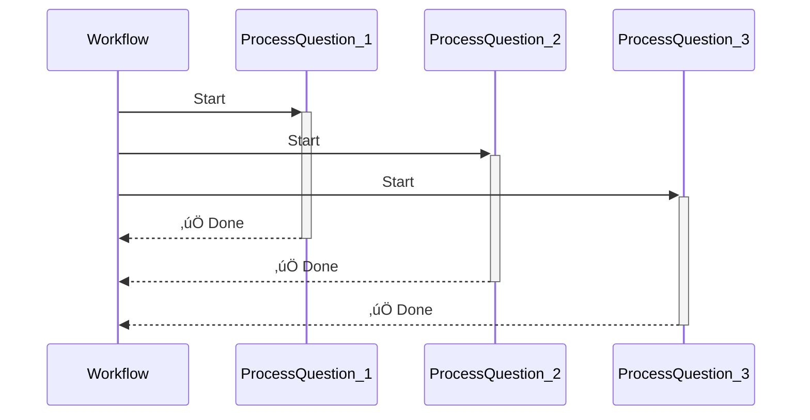
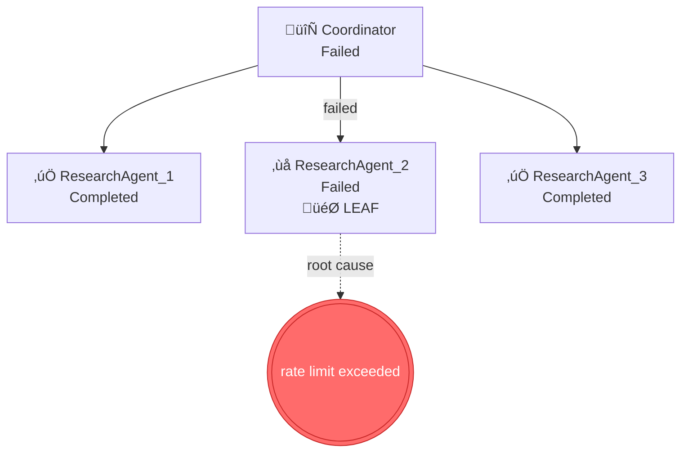
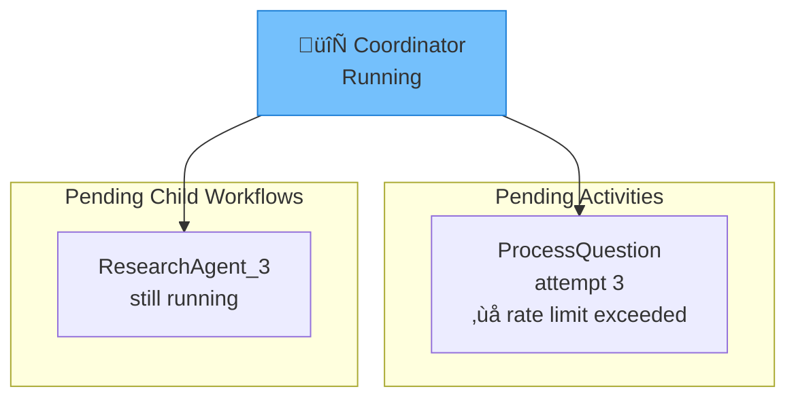

# Building a Distributed AI Research Agent

A step-by-step guide for a junior developer to build a distributed research system using AI assistance. Each step contains the **exact prompt** to give to your AI coding assistant.

---

## Prerequisites

Before starting, make sure you have:
- A local Temporal server running (`temporal server start-dev`)
- The Temporal CLI with agent commands built
- An AI coding assistant (Cursor, Claude Code, etc.)

---

## Teaching Your AI About Temporal Workflow CLI

Your AI assistant needs to know about the `temporal workflow` debugging commands. Here are three ways to set this up:

### Option 1: Add to AI Rules/Instructions (Recommended)

**For Cursor:** Copy the `.cursorrules` file from this example to your project:

```bash
# Copy the ready-to-use rules file
cp examples/ai-research-agent/.cursorrules ./your-project/
```

Or create your own `.cursorrules` file with this content:

**For other AIs:** Add to custom instructions, system prompt, or project rules:

```
When debugging Temporal workflows, use the `temporal workflow` CLI commands:

- `temporal workflow failures --since 1h` - Find recent failures
- `temporal workflow diagnose --workflow-id <id>` - Trace workflow chain to leaf failure
- `temporal workflow show --compact --workflow-id <id>` - Get event timeline
- `temporal workflow describe --pending --workflow-id <id>` - Check pending activities/children

Key flags:
- `--follow-children` - Follow child workflows
- `--leaf-only` - Show only leaf failures (de-duplicate chains)
- `--compact-errors` - Strip wrapper context from errors
- `--group-by error` - Group failures by error type
- `--format mermaid` - Output visual diagrams

Always output JSON with `--format json` for structured data, or `--format mermaid` for diagrams.
```

### Option 2: Load Tool Spec (For Agent Frameworks)

Generate tool specifications for your AI framework:

```bash
# For OpenAI function calling
temporal tool-spec --format openai > temporal-tools.json

# For Claude/Anthropic
temporal tool-spec --format claude > temporal-tools.json

# For LangChain
temporal tool-spec --format langchain > temporal-tools.json
```

Then load this into your agent framework's tool configuration.

### Option 3: Prompt at Session Start

At the beginning of each session, tell your AI:

> "I'm using Temporal for workflow orchestration. When I have issues, use the `temporal workflow` CLI to debug. The commands are:
> - `temporal workflow failures` - find failures
> - `temporal workflow diagnose` - trace workflow chains  
> - `temporal workflow show --compact` - see event history
> - `temporal workflow describe --pending` - check pending work
> 
> Use `--format mermaid` to show me diagrams."

### Verification

Test that your AI knows the commands by asking:

> "How would you debug a failed Temporal workflow?"

**Expected response should include:**
```bash
temporal workflow diagnose --workflow-id <id> --format json
temporal workflow failures --since 1h --follow-children --format json
```

If the AI suggests looking at logs, remind it about the workflow debugging commands (`failures`, `diagnose`, `show --compact`, `describe --pending`).

---

## Phase 1: Basic Workflow

### Prompt 1.1 — Initial Setup

> "I want to build an AI-powered research assistant that can answer complex questions by breaking them into sub-questions, researching each one, and combining the results. Start by creating a simple Temporal workflow that takes a question and returns a hardcoded answer. Set up the project structure with a worker and a starter."

**What the AI should create:**
- `go.mod`
- `types.go` (basic types)
- `workflows/coordinator.go` (simple workflow)
- `worker/main.go`
- `starter/main.go`

**Run it:**
```bash
go run ./worker &
go run ./starter -question "What is Temporal?"
```

---

### Prompt 1.2 — First Failure (Expected)

> "I ran the workflow but nothing seems to happen. How can I see what's going on?"

**What will likely happen:**
- The workflow might be stuck (wrong task queue, activity not registered)
- Or it completed but the starter didn't wait for result

**AI should suggest:**
```bash
# Check if workflow exists
temporal workflow list

# Use workflow diagnose to see what happened
temporal workflow diagnose --workflow-id <id> --format json
```

**This teaches:** Using `workflow diagnose` to understand workflow state.

---

### Prompt 1.3 — Add Real Activity

> "The workflow runs but just returns a hardcoded string. Add an activity that actually 'processes' the question. For now, just simulate processing by sleeping for 2 seconds and returning a formatted response."

**What the AI adds:**
- `activities/research.go` with `ProcessQuestion` activity
- Updates workflow to call the activity

**Likely failure:**
```
activity not registered: ProcessQuestion
```

**AI uses workflow CLI to diagnose:**
```bash
temporal workflow diagnose --workflow-id <id> --format json | jq '.root_cause'
# Shows: "activity not registered"
```

**Fix:** Register activity in worker.

---

## Phase 2: Multi-Step Processing

### Prompt 2.1 — Break Down the Question

> "I want the system to be smarter. Instead of processing the question directly, first break it down into 3 sub-questions, then research each one. Add an activity that takes a question and returns 3 sub-questions."

**What the AI adds:**
- `DecomposeQuestion` activity
- Workflow now has two steps: decompose ‚Üí process

**Run and verify:**
```bash
temporal workflow show --compact --workflow-id <id> --format json | jq '.events[].type'
# Should show: ActivityTaskScheduled, ActivityCompleted, ActivityTaskScheduled...
```

---

### Prompt 2.2 — Add Parallel Research

> "Right now it processes sub-questions one at a time. I want to research all 3 sub-questions in parallel to make it faster. Update the workflow to run them concurrently."

**What the AI changes:**
- Uses `workflow.Go()` or futures to run activities in parallel

**Verify parallelism:**
```bash
temporal workflow show --compact --workflow-id <id> --format json | jq '[.events[] | select(.type == "ActivityTaskScheduled")] | length'
# Should show 3 activities scheduled at nearly the same time

# Or visualize it - parallel activities appear at the same time in the diagram:
temporal workflow show --compact --workflow-id <id> --format mermaid
```

The sequence diagram will clearly show 3 parallel arrows starting simultaneously.

---

### Prompt 2.2b — Visualize the Parallel Execution

> "Show me a diagram of how the parallel activities are executing. I want to visually confirm they're running at the same time."

**Expected AI response:**
```bash
temporal workflow show --compact --workflow-id research-12345 --format mermaid
```

**AI outputs this diagram:**


**AI explains:** "The diagram shows all three activities started at nearly the same time (parallel arrows), and completed independently. This confirms the parallel execution is working correctly."

**This teaches:** Asking the AI for visual confirmation instead of parsing JSON.

---

### Prompt 2.3 — Timeout Issue (Expected)

> "Some questions take too long to research and the workflow seems to hang forever. Add a timeout so each research activity fails if it takes more than 10 seconds."

**What the AI adds:**
- Activity timeout configuration

**Test with slow activity:**
```bash
go run ./starter -question "Very complex philosophical question"
# This triggers a slow path in the activity
```

**Diagnose timeout:**
```bash
temporal workflow failures --since 5m --format json
temporal workflow diagnose --workflow-id <id> --format json | jq '.root_cause'
# Shows: "activity StartToClose timeout"
```

---

## Phase 3: Child Workflows

### Prompt 3.1 — Extract Research Agent

> "The research logic is getting complex. I want each sub-question to be handled by its own separate workflow that can be tracked independently. Convert the parallel activities into child workflows."

**What the AI creates:**
- `workflows/research_agent.go` - new child workflow
- Coordinator now spawns child workflows instead of activities

**Verify chain:**
```bash
temporal workflow diagnose --workflow-id <id> --format json | jq '.chain'
# Shows parent-child hierarchy

# Visualize the chain as a flowchart:
temporal workflow diagnose --workflow-id <id> --format mermaid
```

The flowchart will show:
```
Coordinator ‚Üí ResearchAgent1
           ‚Üí ResearchAgent2
           ‚Üí ResearchAgent3
```

---

### Prompt 3.2 — Child Failure

> "I ran a complex question and one of the research agents failed. But I can't easily see which one failed or why. How do I debug this?"

**AI suggests using agent CLI:**
```bash
# Find recent failures
temporal workflow failures --since 10m --format json

# Get detailed trace showing which child failed
temporal workflow diagnose --workflow-id <id> --format json | jq '{depth: .depth, root_cause: .root_cause}'

# Use leaf-only to see actual failure, not parent wrapper
temporal workflow failures --since 10m --follow-children --leaf-only --format json
```

**This teaches:** Using `--follow-children` and `--leaf-only` for nested workflows.

---

### Prompt 3.2b — Show Me Which Child Failed

> "One of the research agents failed. Show me a diagram of the workflow chain so I can see exactly where the failure is."

**Expected AI response:**
```bash
temporal workflow diagnose --workflow-id coordinator-12345 --format mermaid
```

**AI outputs this diagram:**


**AI explains:** "The flowchart shows that `ResearchAgent_2` (marked as LEAF with 🎯) is the one that failed. The red root cause node shows the error was 'rate limit exceeded'. The other two agents completed successfully."

**This teaches:** Using flowcharts to instantly identify failing branches in a workflow tree.

---

### Prompt 3.3 — Partial Success

> "When one research agent fails, the whole workflow fails. I don't want that. If at least 2 out of 3 agents succeed, continue with what we have. Only fail if more than half fail."

**What the AI changes:**
- Error handling in coordinator to allow partial failures
- Collects successful results, counts failures

**Test:**
```bash
go run ./starter -question "Mixed success question"

# See partial results
temporal workflow diagnose --workflow-id <id> --format json
# Shows some children completed, some failed, parent still succeeded
```

---

## Phase 4: Synthesis & Quality

### Prompt 4.1 — Add Synthesizer

> "After researching sub-questions, I need to combine all the findings into one coherent answer. Add a synthesis step that takes all the research results and produces a final summary."

**What the AI adds:**
- `SynthesizerWorkflow` (child workflow) or `SynthesizeFindings` activity
- Coordinator calls synthesizer after collecting research

**View timeline:**
```bash
temporal workflow show --compact --workflow-id <id> --format json | jq '.events[] | select(.type | contains("Child"))'
# Shows: Research agents start ‚Üí complete ‚Üí Synthesizer starts ‚Üí completes

# Better: Visualize the entire flow as a sequence diagram:
temporal workflow show --compact --workflow-id <id> --format mermaid
```

The sequence diagram shows the orchestration:
```
Coordinator ‚Üí ResearchAgent1: Start
Coordinator ‚Üí ResearchAgent2: Start
Coordinator ‚Üí ResearchAgent3: Start
ResearchAgent1 ‚Üí Coordinator: ‚úÖ Done
ResearchAgent2 ‚Üí Coordinator: ‚úÖ Done
ResearchAgent3 ‚Üí Coordinator: ‚úÖ Done
Coordinator ‚Üí Synthesizer: Start
Synthesizer ‚Üí Coordinator: ‚úÖ Done
```

---

### Prompt 4.2 — Quality Check Gate

> "Sometimes the synthesis is low quality. Add a quality check activity that scores the result. If the score is below 0.7, the workflow should fail with a clear error message."

**What the AI adds:**
- `QualityCheck` activity
- Conditional failure based on score

**Test low quality:**
```bash
go run ./starter -question "Gibberish input that produces bad results"

temporal workflow failures --since 5m --compact-errors --format json | jq '.failures[].root_cause'
# Shows: "quality check failed: score 0.45 below threshold 0.7"
```

**This teaches:** Using `--compact-errors` to get clean error messages.

---

## Phase 5: Reliability

### Prompt 5.1 — Add Retries

> "The research activities sometimes fail due to temporary API errors. Add automatic retries with exponential backoff - try up to 3 times with increasing delays."

**What the AI adds:**
- Retry policy on activities

**Observe retries:**
```bash
# While workflow is running
temporal workflow describe --pending --workflow-id <id> --format json | jq '.pending_activities'
# Shows: attempt: 2, last_failure: "rate limit exceeded"
```

---

### Prompt 5.2 — Simulate Production Load

> "Run 10 research workflows at once to simulate production load. I want to see how the system handles concurrent requests."

**What the AI creates:**
- Loop in starter to launch multiple workflows

**Diagnose failures:**
```bash
# After batch completes
temporal workflow failures --since 10m --format json | jq '.total_count'

# Group by error type to find patterns
temporal workflow failures --since 10m --group-by error --format json | jq '.groups'
# Might show: "rate limit: 6, timeout: 2, success: 2"

# Visualize as a pie chart - instantly see the breakdown:
temporal workflow failures --since 10m --group-by error --format mermaid
```

The pie chart makes patterns obvious at a glance:
```
pie title Failures by error
    "rate limit exceeded" : 6
    "timeout" : 2
    "connection refused" : 1
```

**This teaches:** Using `--group-by` and `--format mermaid` to visualize failure patterns.

---

### Prompt 5.2b — What's Breaking in Production?

> "I ran a load test and many workflows failed. Show me a chart of what's going wrong so I can prioritize fixes."

**Expected AI response:**
```bash
temporal workflow failures --since 10m --follow-children --leaf-only --compact-errors --group-by error --format mermaid
```

**AI outputs this diagram:**


**AI explains:** "The pie chart shows that 60% of failures (15 out of 25) are due to rate limiting. This is your top priority. I recommend:
1. Add rate limiting to your API client
2. Implement exponential backoff with jitter
3. Consider a token bucket pattern for throttling"

**Follow-up prompt:**
> "Which namespaces are most affected?"

**AI response:**
```bash
temporal workflow failures --since 10m --follow-children --group-by namespace --format mermaid
```


**AI explains:** "The research agent namespace has 80% of failures. This confirms the issue is with the downstream research activities, not the coordinator logic."

**This teaches:** Iterative visual debugging with different groupings.

---

### Prompt 5.3 — Graceful Degradation

> "During high load, some research agents hit rate limits. Instead of failing immediately, I want them to wait and retry. But the overall workflow should have a maximum timeout of 5 minutes."

**What the AI changes:**
- Workflow-level timeout
- Longer retry intervals for rate limits

**Test:**
```bash
# Run load test
go run ./starter -load-test -count 20

# Watch for timeouts vs retries
temporal workflow failures --since 10m --status TimedOut --format json
temporal workflow failures --since 10m --status Failed --format json
```

---

## Phase 6: Advanced Features

### Prompt 6.1 — Progress Tracking

> "For long-running research, I want to check the progress. Add a way to query the workflow and see which sub-questions are done and which are still pending."

**What the AI adds:**
- Query handler in workflow
- Progress struct tracking completed/pending

**Check progress:**
```bash
temporal workflow describe --pending --workflow-id <id> --format json
# Shows pending_child_workflows with count

# Visualize pending work:
temporal workflow describe --pending --workflow-id <id> --format mermaid
```

---

### Prompt 6.1b — Show Me What's Still Running

> "The research is taking a long time. Show me a diagram of what's still pending so I can see the bottleneck."

**Expected AI response:**
```bash
temporal workflow describe --pending --workflow-id coordinator-12345 --format mermaid
```

**AI outputs this diagram:**


**AI explains:** "The diagram shows:
1. One activity is stuck retrying (attempt 3, hit rate limit)
2. ResearchAgent_3 is still running

The bottleneck appears to be the rate limit. The activity has already retried 3 times. You may want to:
- Wait for backoff to complete
- Cancel and retry later
- Increase your rate limit quota"

**This teaches:** Using state diagrams to identify bottlenecks in running workflows.

---

### Prompt 6.2 — Human Review Signal

> "For important research, I want a human to approve the results before completing. Add a way to pause the workflow and wait for approval, then continue or reject based on the signal."

**What the AI adds:**
- Signal channel for approval
- Workflow waits after quality check

**Test approval flow:**
```bash
# Start workflow that needs approval
go run ./starter -question "Important research" -require-approval

# Check state - should be waiting
temporal workflow describe --pending --workflow-id <id> --format json
# Shows: status: Running, but no pending activities

# Send approval
temporal workflow signal --workflow-id <id> --name approval --input 'true'
```

---

### Prompt 6.3 — Cancellation

> "Sometimes I want to cancel a long-running research. Add proper cancellation support so child workflows stop gracefully when the parent is cancelled."

**What the AI adds:**
- Cancellation scope
- Cleanup logic in children

**Test:**
```bash
go run ./starter -question "Very long research"

# While running, cancel it
temporal workflow cancel --workflow-id <id>

# Check that children were also cancelled
temporal workflow failures --since 5m --format json | jq '.failures[] | select(.status == "Canceled")'
```

---

## Phase 7: Debugging Challenge

### Prompt 7.1 — Mystery Bug

> "Something weird is happening. I ran a research workflow and it failed, but the error message just says 'synthesis failed'. How do I find the actual root cause?"

**AI walks through debugging:**
```bash
# Step 1: Visualize the chain - immediately see where failure occurred
temporal workflow diagnose --workflow-id <id> --format mermaid
# The flowchart highlights the failing path in red

# Step 2: Get the JSON details
temporal workflow diagnose --workflow-id <id> --format json | jq '.root_cause'
# Shows: error in SynthesizerWorkflow

# Step 3: Trace the child
temporal workflow diagnose --workflow-id <synth-id> --format json | jq '.root_cause'
# Shows: "no findings to synthesize"

# Step 4: Visualize the timeline to see what happened
temporal workflow show --compact --workflow-id <id> --format mermaid
# Sequence diagram shows: 3 research agents all returned errors!

# Step 5: Find the actual root cause
temporal workflow failures --since 10m --follow-children --leaf-only --compact-errors --format json
# Shows: "API key expired"

# Step 6: Visualize failure breakdown
temporal workflow failures --since 10m --group-by error --format mermaid
# Pie chart confirms: 100% of failures are "API key expired"
```

**This teaches:** Using visualization + JSON for comprehensive debugging.

---

### Prompt 7.1b — Visual Debug Session

> "The workflow `coordinator-99999` failed with 'synthesis failed'. I don't understand what happened. Show me diagrams explaining the failure."

**Expected AI response:**

"Let me trace the workflow and show you what happened."

```bash
temporal workflow diagnose --workflow-id coordinator-99999 --format mermaid
```


**AI explains:** "The diagram shows the Coordinator spawned 4 child workflows. All 3 ResearchAgents failed, and the Synthesizer also failed because it had no data to synthesize. But wait - this doesn't show WHY the research agents failed. Let me dig deeper..."

```bash
temporal workflow failures --since 10m --follow-children --leaf-only --group-by error --format mermaid
```


**AI concludes:** "Now I see the real problem:
1. All 3 ResearchAgents failed because the **API key expired**
2. The Synthesizer then failed because it had nothing to synthesize
3. The Coordinator reported 'synthesis failed' but that's just the wrapper

**Root cause:** Your API key is expired. Renew it and the workflow should succeed."

**This teaches:** Using visual debugging to peel back layers of failure wrappers.

---

### Prompt 7.2 — Race Condition

> "Sometimes the same sub-question gets researched twice. I think there's a race condition but I can't figure out where."

**AI uses timeline analysis:**
```bash
temporal workflow show --compact --workflow-id <id> --format json | jq '.events[] | {type, timestamp, details}'
```

**Looking at timestamps reveals:**
- Activity scheduled at T+0
- Same activity scheduled again at T+1 (duplicate!)
- First completes at T+5
- Second fails at T+6 (already processed)

**This teaches:** Using timeline for race condition diagnosis.

---

## Summary: The Agent CLI Learning Path

| Phase | Key Failure | Agent CLI Command Learned | Visualization Prompt |
|-------|-------------|---------------------------|----------------------|
| 1 | Activity not registered | `workflow diagnose --workflow-id <id>` | — |
| 2 | Timeout | `workflow failures --since 5m` | **2.2b:** Sequence diagram |
| 3 | Child workflow failed | `--follow-children --leaf-only` | **3.2b:** Flowchart |
| 4 | Poor quality result | `--compact-errors` | Sequence diagram |
| 5 | Production load failures | `--group-by error` | **5.2b:** Pie chart |
| 6 | Waiting for signal | `workflow describe --pending --workflow-id <id>` | **6.1b:** State diagram |
| 7 | Mystery nested failure | Full debugging workflow | **7.1b:** Combined visuals |

> **Note:** Prompts ending in "b" (e.g., 2.2b, 3.2b) are visualization-focused prompts that teach users to ask the AI for diagrams instead of JSON.

---

## Prompt Template for AI Agents

When asking your AI to diagnose issues, use this template:

> "The workflow `<workflow-id>` failed. Use `temporal workflow` CLI to find the root cause. Start with `workflow diagnose`, then use `workflow failures` if needed. Show me a diagram of what happened. Tell me exactly what went wrong."

The AI should respond with:
1. Commands it ran (including `--format mermaid` for visuals)
2. Mermaid diagram showing the failure chain
3. JSON output analysis for details
4. Root cause identification
5. Suggested fix

**Pro tip:** When debugging is complex, explicitly ask:
> "Show me a flowchart of the workflow chain and a timeline of what happened."

**Example visualization prompts:**

| Situation | What to ask |
|-----------|-------------|
| Workflow failed | "Show me a diagram of the workflow chain" |
| Slow workflow | "Show me what's still pending" |
| Multiple failures | "Show me a pie chart of failure types" |
| Race condition | "Show me the timeline as a sequence diagram" |
| Parent blames child | "Show me the leaf failures in a flowchart" |

---

## Success Criteria

After completing all phases, you should:

1. ‚úÖ Have a working multi-agent research system
2. ‚úÖ Understand how to use `temporal workflow diagnose` for debugging
3. ‚úÖ Know when to use `--follow-children` and `--leaf-only`
4. ‚úÖ Be able to analyze failures with `--group-by`
5. ‚úÖ Use `workflow describe --pending` to check pending work
6. ‚úÖ Debug complex nested failures without looking at logs
7. ‚úÖ Generate visual diagrams with `--format mermaid` for quick understanding
8. ‚úÖ Know which visualization type fits each debugging scenario
9. ‚úÖ Use `temporal workflow describe --pending` to check pending work
