```mermaid
graph TD
    W0[✅ TicketPurchase<br/>Completed]
    W1[✅ SendConfirmation<br/>Completed]
    W0 --> W1
```

# Building TicketDrop: A Distributed Ticket Sales System

A step-by-step guide for building a high-concurrency ticket sales platform using AI assistance. Each step contains the **exact prompt** to give to your AI coding assistant.

**Scenario:** 50,000 fans trying to buy 500 concert tickets in 10 seconds. Race conditions, timeouts, and cascading failures guaranteed.

---

## Prerequisites

Before starting, make sure you have:
- A local Temporal server running (`temporal server start-dev`)
- The Temporal CLI with agent commands (`temporal agent --help`)
- An AI coding assistant (Cursor, Claude Code, etc.)

---

## Teaching Your AI About Temporal Agent CLI

Copy the `.cursorrules` file to your project:

```bash
cp examples/ticketdrop/.cursorrules ./your-project/
```

Or tell your AI at the start of the session:

> "I'm building a Temporal workflow system. When debugging, use `temporal agent` commands:
> - `temporal workflow diagnose --workflow-id <id>` - trace failures
> - `temporal workflow show --compact --workflow-id <id>` - see event sequence
> - `temporal workflow describe --pending --workflow-id <id>` - check pending work
> - `temporal workflow failures --since 5m` - find recent failures
>
> Use `--format mermaid` for diagrams, `--format json` for data."

---

## The Architecture

```
User clicks "Buy Ticket"
         │
         ▼
┌─────────────────┐
│  TicketPurchase │  ← Main workflow (one per user)
│    Workflow     │
└────────┬────────┘
         │
         ├──► ReserveSeat (activity)     - Lock a seat for 5 minutes
         │         │
         │         ▼
         ├──► ProcessPayment (activity)  - Charge credit card
         │         │
         │         ▼
         ├──► IssueTicket (activity)     - Generate QR code
         │         │
         │         ▼
         └──► SendConfirmation (child)   - Email + SMS
```

---

## Phase 1: Basic Purchase Flow

### Prompt 1.1 — Initial Setup

> "I want to build a ticket sales system called TicketDrop. Start with a simple workflow that represents a ticket purchase: take a user ID and event ID, then return a confirmation. Set up the project structure with a worker, a starter, and basic types."

**What the AI should create:**
- `go.mod`
- `types.go` (PurchaseRequest, PurchaseResult)
- `workflows/purchase.go` (TicketPurchaseWorkflow)
- `worker/main.go`
- `starter/main.go`

**Run it:**
```bash
go run ./worker &
go run ./starter --user-id user-123 --event-id concert-taylor-swift
```

---

### Prompt 1.2 — First Failure (Expected)

> "I ran the workflow but it just returns immediately with empty data. How do I see what happened?"

**AI should suggest:**
```bash
temporal workflow list
temporal workflow diagnose --workflow-id <id> --format json
```

**What you'll likely see:** The workflow completed but didn't do anything meaningful.

**This teaches:** Using `agent trace` to understand workflow execution.

---

### Prompt 1.3 — Add Seat Reservation

> "Add an activity that reserves a seat. For now, simulate it by sleeping 1 second and returning the seat number. The activity should take the event ID and return an available seat like 'A15'."

**What the AI adds:**
- `activities/reservation.go` with `ReserveSeat` activity
- Updates workflow to call the activity

**Likely failure:**
```
activity not registered: ReserveSeat
```

**Debug with CLI:**
```bash
temporal workflow diagnose --workflow-id purchase-123 --format json | jq '.root_cause'
# Shows: "activity not registered"
```

**Fix:** Register activity in worker.

---

## Phase 2: Payment Processing

### Prompt 2.1 — Add Payment Activity

> "After reserving a seat, add a payment processing activity. It should take the user ID and amount, simulate processing for 2 seconds, and return a payment confirmation ID. Sometimes payments fail - add a 20% random failure rate."

**What the AI adds:**
- `activities/payment.go` with `ProcessPayment` activity
- 20% chance of returning an error
- Workflow now: Reserve → Payment

**Test failures:**
```bash
# Run multiple times to see failures
for i in {1..10}; do
  go run ./starter --user-id user-$i --event-id concert-1
done

# Check failures
temporal workflow failures --since 5m --format json
```

---

### Prompt 2.2 — See Failure Details

> "Some purchases are failing. Show me exactly what's going wrong."

**AI should use:**
```bash
temporal workflow failures --since 5m --format json | jq '.failures[] | {workflow: .root_workflow.workflow_id, error: .root_cause}'

# Or visualize:
temporal workflow failures --since 5m --group-by error --format mermaid
```

**Expected output:**


**This teaches:** Using `--group-by error` to find patterns.

---

### Prompt 2.3 — Payment Timeout Handling

> "Sometimes the payment takes too long and the workflow seems stuck. Add a 10-second timeout on the payment activity. If it times out, the purchase should fail gracefully."

**What the AI adds:**
- `StartToCloseTimeout: 10 * time.Second` on payment activity

**Test timeout:**
```bash
# Modify activity to sometimes sleep 15 seconds
go run ./starter --user-id slow-user --event-id concert-1

# Check what's pending
temporal workflow describe --pending --workflow-id purchase-slow-user --format mermaid
```

**State diagram shows:**

```mermaid
graph TD
    WF[🔄 TicketPurchase<br/>Running]
    subgraph Activities["Pending Activities"]
        A0[ProcessPayment<br/>attempt 1<br/>⏳ running]
    end
    WF --> A0
```


---

## Phase 3: Seat Inventory (Race Conditions!)

### Prompt 3.1 — Limited Seats

> "Right now every purchase gets a seat. Make it realistic: there are only 10 seats available. Add an in-memory inventory that tracks available seats. If no seats are left, the reservation should fail."

**What the AI changes:**
- `inventory.go` with shared seat map
- `ReserveSeat` now checks and decrements inventory
- Returns error if no seats available

**Run concurrent purchases:**
```bash
# Try to buy 15 tickets for 10 seats
for i in {1..15}; do
  go run ./starter --user-id user-$i --event-id concert-1 &
done
wait

# Check results
temporal workflow failures --since 2m --format json | jq '.total_count'
# Should show ~5 failures
```

---

### Prompt 3.2 — The Double-Booking Bug

> "I noticed something weird. Sometimes two users get the same seat! How do I debug this?"

**AI should investigate:**
```bash
# Find all successful purchases
temporal workflow list --query 'ExecutionStatus="Completed"' -o json | jq -r '.[] | .workflowId'

# Check the timeline of two suspicious purchases
temporal workflow show --compact --workflow-id purchase-user-3 --format mermaid
temporal workflow show --compact --workflow-id purchase-user-7 --format mermaid
```

**Timeline reveals the race:**


**This teaches:** Using `timeline` to diagnose race conditions.

---

### Prompt 3.3 — Fix the Race Condition

> "The timeline shows that two users are checking the same seat simultaneously. How do I fix this race condition?"

**What the AI should suggest:**
- Use a mutex/lock in the activity
- Or better: use a single workflow per seat that serializes access
- Or: use Temporal's built-in saga pattern with compensation

**After fix, verify:**
```bash
# Run load test again
for i in {1..15}; do
  go run ./starter --user-id user-$i --event-id concert-1 &
done
wait

# All failures should now be "no seats available", not double-booking
temporal workflow failures --since 2m --group-by error --format mermaid
```

---

## Phase 4: Seat Release on Failure

### Prompt 4.1 — Stuck Seats Problem

> "When a payment fails after a seat is reserved, the seat stays reserved forever. Add compensation: if payment fails, release the seat back to inventory."

**What the AI adds:**
- `ReleaseSeat` activity
- Saga pattern: Reserve → Payment (if fails → Release)

**Test:**
```bash
# Trigger payment failure
go run ./starter --user-id unlucky-user --event-id concert-1

# Wait for failure, then check trace
temporal workflow diagnose --workflow-id purchase-unlucky-user --format mermaid
```

**Expected flowchart:**

```mermaid
graph TD
    W0[❌ TicketPurchase<br/>Failed]
    A1[✅ ReserveSeat<br/>Completed]
    A2[❌ ProcessPayment<br/>Failed]
    A3[✅ ReleaseSeat<br/>Completed]
    W0 --> A1 --> A2
    A2 -->|compensation| A3
    RC(((payment declined)))
    A2 -.->|root cause| RC
```


**This teaches:** Visualizing saga/compensation patterns.

---

### Prompt 4.2 — Release Timeout Bug

> "The seat release is sometimes taking forever. I think it's hanging. How do I see what's stuck?"

**AI uses state command:**
```bash
temporal workflow describe --pending --workflow-id purchase-unlucky-user --format mermaid
```

**Output shows:**

```mermaid
graph TD
    WF[🔄 TicketPurchase<br/>Running]
    subgraph Activities["Pending Activities"]
        A0[ReleaseSeat<br/>attempt 5<br/>❌ inventory service unavailable]
    end
    WF --> A0
```


**This teaches:** Using `state` to find stuck activities.

---

## Phase 5: Queue Management

### Prompt 5.1 — Add a Queue

> "During high traffic, we need to queue users fairly. Add a queue workflow that users enter before starting their purchase. Process users in order, max 10 concurrent purchases."

**What the AI creates:**
- `workflows/queue.go` with `QueueManagerWorkflow`
- Users signal the queue to join
- Queue spawns `TicketPurchaseWorkflow` as children (max 10)

**Structure:**
```
QueueManager (long-running)
    ├── TicketPurchase (user-1) 
    ├── TicketPurchase (user-2)
    ├── ... (up to 10 concurrent)
    └── Waiting: user-11, user-12, ...
```

---

### Prompt 5.2 — Queue State Visibility

> "How can I see who's in the queue and how many are being processed?"

**AI uses:**
```bash
temporal workflow describe --pending --workflow-id queue-concert-1 --format json
```

**Output:**
```json
{
  "workflow": { "workflow_id": "queue-concert-1" },
  "status": "Running",
  "pending_child_workflow_count": 10,
  "pending_child_workflows": [
    { "workflow_id": "purchase-user-1", "workflow_type": "TicketPurchase" },
    { "workflow_id": "purchase-user-2", "workflow_type": "TicketPurchase" }
  ]
}
```

**Or visualize:**
```bash
temporal workflow describe --pending --workflow-id queue-concert-1 --format mermaid
```

---

### Prompt 5.3 — User Loses Queue Position

> "A user is complaining they were in position 5 but after a page refresh they're at position 50. How do I investigate?"

**AI uses timeline:**
```bash
temporal workflow show --compact --workflow-id queue-concert-1 --format json | jq '.events[] | select(.name == "UserJoined")'
```

**Investigation reveals:** The user's browser sent the join signal twice (on refresh), and the workflow didn't handle duplicate joins.

**This teaches:** Using `timeline` to debug business logic issues.

---

## Phase 6: Notifications

### Prompt 6.1 — Add Email Confirmation

> "After a successful purchase, send an email confirmation. Add this as a child workflow so it doesn't block the main purchase."

**What the AI creates:**
- `workflows/notification.go` with `SendConfirmationWorkflow`
- Main workflow spawns it after successful payment
- Child workflow: email activity + SMS activity (parallel)

**Verify:**
```bash
temporal workflow diagnose --workflow-id purchase-happy-user --format mermaid
```

**Shows:**


---

### Prompt 6.2 — Email Fails, Ticket Still Valid

> "The email service is down but tickets should still be issued. How do I make email failures not fail the whole purchase?"

**What the AI changes:**
- Use `ChildWorkflowOptions{ParentClosePolicy: ABANDON}`
- Or catch email errors and log them

**Test with broken email:**
```bash
go run ./starter --user-id test-user --event-id concert-1

# Check that purchase succeeded but notification failed
# trace automatically follows children
temporal workflow diagnose --workflow-id purchase-test-user --format mermaid
```

**Shows:**


```mermaid
graph TD
    W0[✅ TicketPurchase<br/>Completed]
    W1[❌ SendConfirmation<br/>Failed<br/>🎯 LEAF]
    W0 --> W1
    RC(((SMTP connection refused)))
    W1 -.->|root cause| RC
```

**Key insight:** Parent succeeded despite child failure.

---

## Phase 7: Load Test & Chaos

### Prompt 7.1 — Simulate Concert Drop

> "Simulate a real ticket drop: 100 users trying to buy 20 tickets at exactly the same time. Show me what breaks."

**What the AI creates:**
- `loadtest/main.go` that spawns 100 concurrent workflows

**Run:**
```bash
go run ./loadtest --users 100 --tickets 20 --event concert-final

# Watch chaos unfold
temporal workflow failures --since 2m --follow-children --group-by error --format mermaid
```

**Expected pie chart:**


**This teaches:** Using load tests to discover edge cases.

---

### Prompt 7.2 — Which Users Got Tickets?

> "After the chaos, which users actually got tickets? Show me."

**AI queries:**
```bash
# Find all completed purchases
temporal workflow list --query 'WorkflowType="TicketPurchaseWorkflow" AND ExecutionStatus="Completed"' -o json | jq -r '.[].workflowId'

# Check timing - who was fastest?
temporal workflow show --compact --workflow-id purchase-user-15 --format json | jq '.duration_ms'
```

---

## Summary: The TicketDrop CLI Learning Path

| Phase | Bug/Scenario | CLI Command | Visualization |
|-------|--------------|-------------|---------------|
| 1 | Activity not registered | `trace --format json` | — |
| 2 | Payment failures | `failures --group-by error` | Pie chart |
| 3 | Double-booking race | `timeline --format mermaid` | Sequence diagram |
| 4 | Compensation flow | `trace --format mermaid` | Flowchart with saga |
| 5 | Stuck seat release | `state --format mermaid` | State diagram |
| 6 | Queue position | `timeline --format json` | — |
| 7 | Notification failure | `trace` (auto-follows children) | Flowchart |
| 8 | Load test chaos | `failures --group-by error` | Pie chart |

---

## Debugging Template

When something goes wrong, ask your AI:

> "The purchase workflow `<workflow-id>` failed. Use `temporal agent` to find out why. Show me a diagram."

**Expected AI response:**
```bash
# Step 1: Trace the failure chain
temporal workflow diagnose --workflow-id purchase-123 --format mermaid

# Step 2: If payment/notification involved, follow children
# trace automatically follows child workflows
temporal workflow diagnose --workflow-id purchase-123 --format mermaid

# Step 3: Check timing if race condition suspected
temporal workflow show --compact --workflow-id purchase-123 --format mermaid

# Step 4: If stuck, check pending work
temporal workflow describe --pending --workflow-id purchase-123 --format mermaid
```

---

## Success Criteria

After completing all phases, you should:

1. ✅ Handle concurrent seat reservations without double-booking
2. ✅ Release seats when payments fail (saga pattern)
3. ✅ Queue users fairly during high traffic
4. ✅ Send notifications without blocking purchases
5. ✅ Debug race conditions using `timeline`
6. ✅ Find failure patterns using `failures --group-by`
7. ✅ Visualize stuck workflows using `state`
8. ✅ Trace child workflow failures using `--follow-children`

